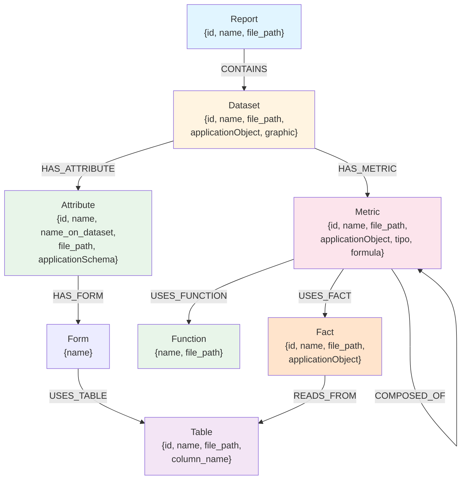
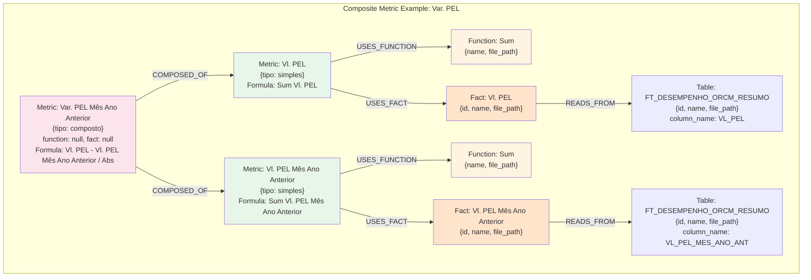
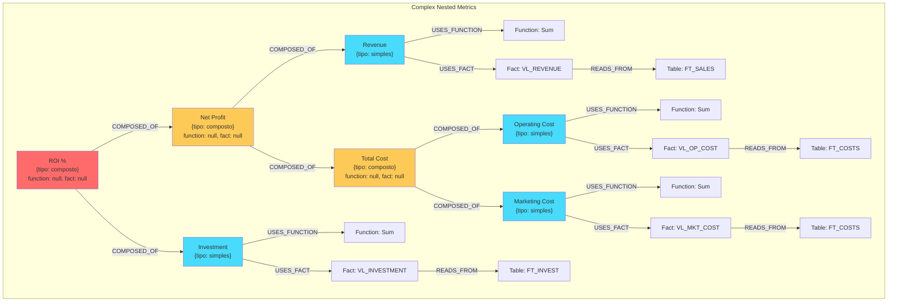
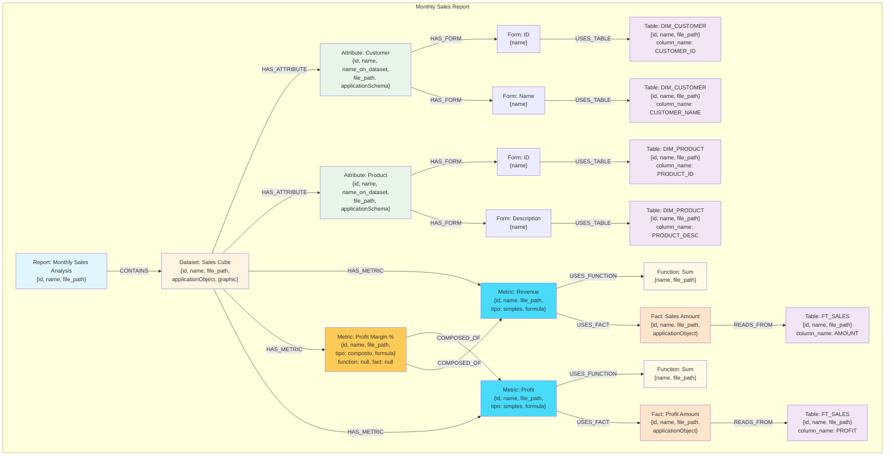

# MicroStrategy Data Model Extractor

Professional data extraction tool for parsing MicroStrategy HTML documentation and extracting complex relationships between reports, datasets, attributes, metrics, and source tables.

## 📋 Table of Contents

- [Installation](#installation)
- [How to Use](#how-to-use)
  - [Configuration](#configuration)
  - [Commands](#commands)
  - [Export to CSV](#export-to-csv)
- [Project Structure](#project-structure)
- [Data Model](#data-model)
  - [JSON Schema](#json-schema)
  - [Graph Model](#graph-model)

---

## 🚀 Installation

### Prerequisites

- Python 3.8 or higher
- pip (Python package manager)
- MicroStrategy HTML documentation files

### Steps

1. **Install dependencies:**

```bash
pip install -r requirements.txt
```

2. **Optional - Install as package (recommended):**

```bash
pip install -e .
```

This allows you to import the package from anywhere without modifying `sys.path`.

3. **Verify installation:**

```bash
python -c "import sys; sys.path.insert(0, 'src'); from microstrategy_extractor import Config; print('✓ Installation successful')"
```

---

## 📖 How to Use

### Configuration

#### 1. Environment Variables (.env)

Create a `.env` file in the project root:

```bash
# Input path
BASE_PATH=RAW_DATA/04 - Relatórios Gerenciais - BARE (20250519221644)

# Output paths
OUTPUT_JSON=output.json
OUTPUT_CSV_DIR=output_csv

# Cache settings
CACHE_ENABLED=true
CACHE_SIZE_LIMIT=1000

# Logging
LOG_LEVEL=INFO
VERBOSE=false

# Performance (parallel processing)
PARALLEL_ENABLED=false
MAX_WORKERS=4
```

**Configuration Parameters:**

| Parameter | Description | Default | Valid Values |
|-----------|-------------|---------|--------------|
| `BASE_PATH` | Directory containing MicroStrategy HTML files | Required | Valid directory path |
| `OUTPUT_JSON` | Output JSON file path | `output.json` | Any .json file path |
| `OUTPUT_CSV_DIR` | Directory for CSV exports | `output_csv` | Any directory path |
| `CACHE_ENABLED` | Enable/disable caching | `true` | `true`, `false` |
| `CACHE_SIZE_LIMIT` | Maximum cache items (LRU eviction) | `1000` | Positive integer |
| `LOG_LEVEL` | Logging verbosity | `INFO` | `DEBUG`, `INFO`, `WARNING`, `ERROR`, `CRITICAL` |
| `VERBOSE` | Enable detailed logs | `false` | `true`, `false` |
| `PARALLEL_ENABLED` | Enable parallel processing | `false` | `true`, `false` |
| `MAX_WORKERS` | Number of parallel workers | `4` | 1-8 (depends on CPU cores) |

#### 2. Cache Configuration

The system uses an **LRU (Least Recently Used)** cache with namespace isolation:

- **Namespaces**: `files`, `metrics`, `attributes`, `reports`, `datasets`
- **Eviction Policy**: Automatic LRU when cache reaches `CACHE_SIZE_LIMIT`
- **Benefits**: 2-4x faster extraction on subsequent runs

**Cache Usage Example:**

```python
from microstrategy_extractor.cache import MemoryCache
from microstrategy_extractor.extractors import ReportExtractor

# Custom cache size
cache = MemoryCache(max_size=5000)
extractor = ReportExtractor(base_path, cache=cache)

# Check cache statistics
stats = extractor.get_cache_stats()
print(f"Cached items: {stats}")
```

#### 3. Programmatic Configuration

```python
import sys
sys.path.insert(0, 'src')

from microstrategy_extractor.config.settings import Config
from pathlib import Path

# Method 1: From environment variables
config = Config.from_env()

# Method 2: Direct configuration
config = Config(
    base_path=Path("RAW_DATA/04 - Relatórios Gerenciais"),
    output_json_path=Path("output.json"),
    output_csv_dir=Path("output_csv"),
    log_level="DEBUG",
    cache_size_limit=5000,
    verbose=True
)

# Validate configuration
errors = config.validate()
if errors:
    for error in errors:
        print(f"Config error: {error}")
```

---

### Commands

#### 1. Extract All Reports

Extract all reports from the HTML documentation:

```bash
python main.py \
  --base-path "RAW_DATA/04 - Relatórios Gerenciais - BARE (20250519221644)" \
  --output-json output.json \
  --output-csv-dir output_csv
```

#### 2. Extract Specific Report by Name

```bash
python main.py \
  --base-path "RAW_DATA/04 - Relatórios Gerenciais" \
  --report "04.10.043 - Resultado Comercial - Líderes" \
  --output-json output.json
```

#### 3. Extract by Report ID

```bash
python main.py \
  --base-path "RAW_DATA/04 - Relatórios Gerenciais" \
  --report-id "D8C7F01F4650B3CBC97AB991C79FB9DF" \
  --output-json output.json
```

#### 4. Verbose Mode (Debug Logging)

```bash
python main.py \
  --base-path "RAW_DATA/04 - Relatórios Gerenciais" \
  --output-json output.json \
  --verbose
```

#### Python API Usage

```python
import sys
sys.path.insert(0, 'src')

from microstrategy_extractor.extractors import ReportExtractor
from microstrategy_extractor.exporters import CSVExporter
from microstrategy_extractor.validators import DataValidator
from pathlib import Path

# Initialize extractor
base_path = Path("RAW_DATA/04 - Relatórios Gerenciais")
extractor = ReportExtractor(base_path)

# Extract all reports
relatorios = extractor.extract_all_reports()
print(f"Extracted {len(relatorios)} reports")

# Extract specific report
relatorios = extractor.extract_report("Report Name")

# Extract by ID
relatorio = extractor.extract_report_by_id("ABC123...")

# Validate data
validator = DataValidator()
result = validator.validate_extraction(relatorios)
if result.valid:
    print("✓ All data is valid")
else:
    for error in result.errors:
        print(f"✗ {error}")
```

#### Parallel Processing (2-4x Faster)

For extracting 10+ reports:

```python
from microstrategy_extractor.extractors import extract_reports_parallel

relatorios = extract_reports_parallel(
    base_path,
    max_workers=4  # Number of CPU cores
)
```

**Performance Benchmarks:**

| Reports | Sequential | Parallel (4 cores) | Speedup |
|---------|-----------|-------------------|---------|
| 10      | ~2 min    | ~1 min            | 2x      |
| 50      | ~7 min    | ~2.5 min          | 2.8x    |
| 100     | ~15 min   | ~4-6 min          | 3-4x    |

---

### Export to CSV

The system exports **16 normalized CSV files** organized into entities and relationships.

#### Entity Files (8)

1. **Reports.csv** - Report objects
   - Fields: `id`, `name`, `file_path`

2. **DataSets.csv** - Dataset objects (Intelligent Cubes, Reports, Shortcuts)
   - Fields: `id`, `name`, `file_path`, `applicationObject`, `graphic`

3. **Attributes.csv** - Attribute objects
   - Fields: `id`, `name`, `name_on_dataset`, `file_path`, `applicationSchema`

4. **Metrics.csv** - Metric objects
   - Fields: `id`, `name`, `file_path`, `applicationObject`, `tipo`, `formula`

5. **Facts.csv** - Fact objects
   - Fields: `id`, `name`, `file_path`, `applicationObject`

6. **Functions.csv** - Aggregation functions
   - Fields: `id`, `name`, `file_path`, `applicationObject`

7. **Tables.csv** - Logical tables (source tables)
   - Fields: `id`, `name`, `file_path`, `applicationObject`

8. **AttributesForm.csv** - Attribute forms
   - Fields: `attribute_id`, `form_name`

#### Relationship Files (8)

1. **Report_DataSet.csv** - Report → DataSet
   - Fields: `report_id`, `dataset_id`

2. **DataSet_Attribute.csv** - DataSet → Attribute
   - Fields: `dataset_id`, `attribute_id`

3. **DataSet_Metric.csv** - DataSet → Metric
   - Fields: `dataset_id`, `metric_id`

4. **AttributeForm_Table.csv** - Attribute Form → Table
   - Fields: `attribute_id`, `form_name`, `table_id`, `column_name`

5. **Metric_Function.csv** - Metric → Function
   - Fields: `metric_id`, `function_id`

6. **Metric_Fact.csv** - Metric → Fact
   - Fields: `metric_id`, `fact_id`

7. **Fact_Table.csv** - Fact → Table
   - Fields: `fact_id`, `table_id`, `column_name`

8. **Metric_Metric.csv** - Composite Metric → Component Metrics
   - Fields: `metric_parent_id`, `metric_child_id`

#### Export Usage

```python
from microstrategy_extractor.exporters import CSVExporter
from pathlib import Path

# Export to CSV
exporter = CSVExporter(Path("output_csv"))
exporter.export(relatorios)

print("✓ Exported 16 CSV files to output_csv/")
```

The CSV files can be imported into:
- Excel / Google Sheets
- Relational databases (PostgreSQL, MySQL)
- Power BI / Tableau
- Pandas for analysis

---

## 📁 Project Structure

```
BlankProject/
├── src/
│   └── microstrategy_extractor/          # Main package
│       ├── core/                          # Core models and types
│       │   ├── constants.py               # Constants and enums
│       │   ├── exceptions.py              # Custom exceptions
│       │   ├── models.py                  # Data models (Pydantic)
│       │   └── types.py                   # Type definitions
│       │
│       ├── config/                        # Configuration management
│       │   └── settings.py                # Config class (env, CLI, code)
│       │
│       ├── cache/                         # Cache abstraction
│       │   ├── cache_manager.py           # Abstract cache interface
│       │   └── memory_cache.py            # LRU cache implementation
│       │
│       ├── parsers/                       # HTML parsing modules
│       │   ├── base_parser.py             # Base parser class
│       │   ├── report_parser.py           # Report parsing
│       │   ├── metric_parser.py           # Metric parsing
│       │   ├── attribute_parser.py        # Attribute parsing
│       │   ├── fact_parser.py             # Fact parsing
│       │   └── link_resolver.py           # Link resolution (ID/name)
│       │
│       ├── extractors/                    # Extraction logic
│       │   ├── base_extractor.py          # Base extractor class
│       │   ├── report_extractor.py        # Report extraction
│       │   ├── metric_extractor.py        # Metric extraction
│       │   ├── attribute_extractor.py     # Attribute extraction
│       │   ├── dataset_extractor.py       # Dataset extraction
│       │   ├── parallel_extractor.py      # Parallel processing
│       │   └── extractor_helpers.py       # Helper functions
│       │
│       ├── exporters/                     # Data export
│       │   └── csv_exporter.py            # CSV export (16 files)
│       │
│       ├── validators/                    # Data validation
│       │   └── data_validator.py          # Pydantic validators
│       │
│       ├── utils/                         # Utilities
│       │   ├── logger.py                  # Structured logging
│       │   └── text_normalizer.py         # Text normalization
│       │
│       ├── db/                            # Database utilities
│       │   └── schema_loader.py           # YAML schema loader
│       │
│       └── legacy/                        # Deprecated code
│           └── (old modules)
│
├── config/                                # Configuration files
│   └── db_schema.yaml                     # Database schema definition
│
├── scripts/                               # Utility scripts
│   ├── import_to_database.py              # Import CSV to database
│   └── normalize_data.py                  # JSON to CSV conversion
│
├── RAW_DATA/                              # Input HTML files
│   └── (MicroStrategy HTML documentation)
│
├── output_csv/                            # CSV exports
│   └── (16 CSV files)
│
├── main.py                                # CLI entry point
├── requirements.txt                       # Python dependencies
├── pyproject.toml                         # Modern packaging config
├── output.json                            # JSON export
└── README.md                              # This file
```

---

## 📊 Data Model

### JSON Schema

The extraction produces a hierarchical JSON structure representing the complete MicroStrategy data model:

```json
{
  "relatorios": [
    {
      "name": "",
      "id": "",
      "file_path": "",
      "datasets": [
        {
          "name": "",
          "id": "",
          "file_path": "",
          "applicationObject": "",
          "graphic": "",
          "atributos": [
            {
              "name": "",
              "name_on_dataset": "",
              "id": "",
              "file_path": "",
              "applicationSchema": "",
              "formularios": [
                {
                  "name": "",
                  "logic_tables": [
                    {
                      "name": "",
                      "id": "",
                      "file_path": "",
                      "column_name": ""
                    }
                  ]
                }
              ]
            }
          ],
          "metricas": [
            {
              "name": "",
              "id": "",
              "file_path": "",
              "applicationObject": "",
              "tipo": "",
              "formula": "",
              "function": {
                "name": "",
                "file_path": ""
              },
              "fact": {
                "name": "",
                "id": "",
                "file_path": "",
                "applicationObject": "",
                "logic_tables": [
                  {
                    "name": "",
                    "id": "",
                    "file_path": "",
                    "column_name": ""
                  }
                ]
              },
              "metricas": []
            }
          ]
        }
      ]
    }
  ]
}
```

**Field Descriptions:**

| Field | Type | Description | Possible Values |
|-------|------|-------------|-----------------|
| `name` | string | Object name | Any string |
| `id` | string | Unique MicroStrategy ID (32 chars hex) | e.g., "D8C7F01F4650B3CBC97AB991C79FB9DF" |
| `file_path` | string | HTML file reference | e.g., "ABC123_1.html#DEF456" |
| `applicationObject` | string | MicroStrategy object type | "Metrica", "Fato", "Função", "TabelaLogica", "CuboInteligente", "Report", "Atalho" |
| `applicationSchema` | string | Schema classification | "Atributo" |
| `graphic` | string | Graphic/chart type | null or chart type |
| `tipo` | string | Metric type | "simples" (simple), "composto" (composite) |
| `formula` | string | Metric formula | e.g., "Sum(VL_REALIZADO)" |
| `column_name` | string | Database column name | e.g., "VL_RESS" |
| `name_on_dataset` | string | Attribute name as displayed | May differ from `name` |
| `formularios` | array | Attribute forms | List of form objects |
| `logic_tables` | array | Source tables | List of table objects |
| `metricas` | array | Component metrics (for composite) | Recursive metric list |

---

### Graph Model

The data model forms a **property graph** with nodes and directed relationships, supporting recursive metric composition.

#### Graph Nodes



#### Complete Relationship Model

| Source | Relationship | Target | Cardinality | Description |
|--------|--------------|--------|-------------|-------------|
| **Report** | `CONTAINS` | **Dataset** | 1:N | A report contains one or more datasets |
| **Dataset** | `HAS_ATTRIBUTE` | **Attribute** | 1:N | A dataset contains attributes (embedded in JSON) |
| **Dataset** | `HAS_METRIC` | **Metric** | 1:N | A dataset contains metrics (embedded in JSON) |
| **Attribute** | `HAS_FORM` | **Form** | 1:N | An attribute has multiple forms (ID, DESC, etc.) |
| **Form** | `USES_TABLE` | **Table** | 1:N | A form uses one or more logic tables with column_name |
| **Metric** | `USES_FUNCTION` | **Function** | 0..1 | Simple metrics use one aggregation function (null for composite) |
| **Metric** | `USES_FACT` | **Fact** | 0..1 | Simple metrics aggregate one fact (null for composite) |
| **Metric** | `COMPOSED_OF` | **Metric** | 0..N | **Recursive: composite metrics reference child metrics** |
| **Fact** | `READS_FROM` | **Table** | 1:N | A fact reads from one or more logic tables with column_name |

**Important Notes:**
- **`column_name`** is a **property on the Table relationship**, not a separate node
- **Function** has NO `id` property (only `name` and `file_path`)
- **Attributes and Metrics** are embedded arrays within Dataset (not separate top-level entities)
- **Composite metrics** have `function: null` and `fact: null` - only `metricas` array is populated
- **Simple metrics** have `function` and `fact` populated - `metricas` is an empty array

#### How Composite Metrics Work

**The `COMPOSED_OF` relationship enables recursive metric composition:**



**Key Points about `COMPOSED_OF`:**

1. **Recursive Nature**: Composite metrics can reference other composite metrics (unlimited depth)
2. **Type Distinction**: 
   - `tipo: "simples"` → Has `function` and `fact` objects populated, `metricas: []`
   - `tipo: "composto"` → Has `function: null` and `fact: null`, `metricas: [...]` populated
3. **Reusability**: The same metric can be reused in multiple composite metrics
4. **Circular Detection**: The extractor prevents infinite loops in circular references
5. **column_name**: Stored as a property on the Table object in the `logic_tables` array, not a separate entity

#### Example: Three-Level Metric Composition



**This shows:**
- **Level 1** (Red): ROI % is composed of Net Profit and Investment (composite metric with null function/fact)
- **Level 2** (Yellow): Net Profit and Total Cost are also composite metrics (function: null, fact: null)
- **Level 3** (Blue): All leaf metrics are simple metrics with function and fact objects populated

#### Complete Report Structure Example



#### Graph Characteristics

1. **Property Graph**: Each node has properties (id, name, file_path, etc.) - column_name is a property, not a node
2. **Directed Relationships**: All edges have direction and semantic meaning
3. **Recursive Structure**: `COMPOSED_OF` enables unlimited metric nesting depth
4. **Embedded Collections**: Attributes and Metrics are embedded arrays within Dataset (composition relationship)
5. **Null Handling**: Composite metrics have `function: null` and `fact: null`; simple metrics have `metricas: []`
6. **Type Safety**: Nodes have distinct types with specific properties
7. **Function Identification**: Functions only have `{name, file_path}` - no unique `id` field
8. **Traversable**: Can navigate from Report → Dataset → Attribute → Form → Table (with column_name property)
9. **Traversable (Metrics)**: Can navigate from Report → Dataset → Metric → Fact → Table (with column_name property)
10. **Traversable (Composite)**: Can navigate from Metric → Metric → Metric (recursive composition)

---

## 🎯 Key Features

- ✅ **Modular Architecture**: Strategy pattern, dependency injection, SOLID principles
- ✅ **Parallel Processing**: 2-4x faster extraction with multi-core support
- ✅ **Data Validation**: Pydantic models with strict validation
- ✅ **Optimized Caching**: LRU cache with namespace isolation
- ✅ **Recursive Metrics**: Supports complex composite metric structures
- ✅ **Encoding Handling**: Automatic detection (UTF-8, ISO-8859-1, Latin-1)
- ✅ **Multiple Exports**: JSON (hierarchical) and CSV (normalized)
- ✅ **Flexible Configuration**: Environment variables, CLI args, programmatic
- ✅ **Zero Hardcoding**: All values configurable
- ✅ **Type Safety**: Complete type hints throughout codebase
- ✅ **Structured Logging**: Contextual logging with multiple levels

---

## 🔧 Advanced Usage

### Custom Cache Configuration

```python
from microstrategy_extractor.cache import MemoryCache

# Large cache for big datasets
cache = MemoryCache(max_size=5000)
extractor = ReportExtractor(base_path, cache=cache)

# Check cache stats
stats = extractor.get_cache_stats()
print(f"Files: {stats['files']}, Metrics: {stats['metrics']}")

# Clear specific namespace
extractor.clear_cache(namespace="files")
```

### Strict Data Validation

```python
from microstrategy_extractor.validators import DataValidator

# Strict mode (warnings = errors)
validator = DataValidator(strict=True)
result = validator.validate_extraction(relatorios)

if not result.valid:
    print(f"Validation errors: {len(result.errors)}")
    for error in result.errors:
        print(f"  - {error}")
```

### Database Import

```bash
# Generate SQL schema
cd scripts
python import_to_database.py \
  --connection-string "host=localhost dbname=mstr user=user password=pass" \
  --csv-dir ../output_csv
```

---

## 🐛 Troubleshooting

### Import Errors

```python
# Add src/ to Python path
import sys
sys.path.insert(0, 'src')

# Or install as package
pip install -e .
```

### Encoding Issues

The parser tries multiple encodings automatically (ISO-8859-1, Latin-1, UTF-8). HTML index files (Atributo.html, Métrica.html) are always preferred for name resolution.

### Cache Issues

```python
# Clear cache if needed
extractor.clear_cache()

# Increase cache size
config.cache_size_limit = 5000
```

### Performance Issues

- Use parallel processing for 10+ reports
- Increase cache size for large datasets
- Enable only necessary validation

---

## 📄 Requirements

```
beautifulsoup4>=4.12.0
lxml>=4.9.0
pyyaml>=6.0.0
pydantic>=2.0.0
```

**Optional:**
- `psycopg2-binary` - PostgreSQL database support
- `pytest`, `black`, `mypy`, `ruff` - Development tools

---

## 📞 Support

For questions or issues:
1. Check configuration in `.env` file
2. Enable verbose mode with `--verbose` flag
3. Review logs for detailed error messages
4. Verify HTML file structure in `BASE_PATH`

---

**Version**: 2.0.0  
**Status**: Production Ready  
**License**: MIT
