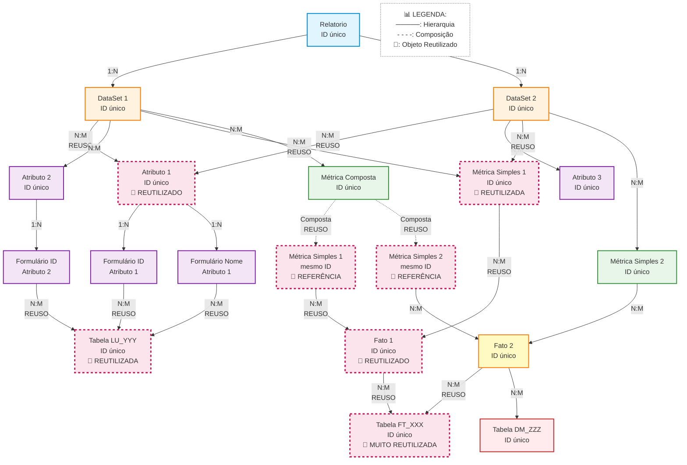
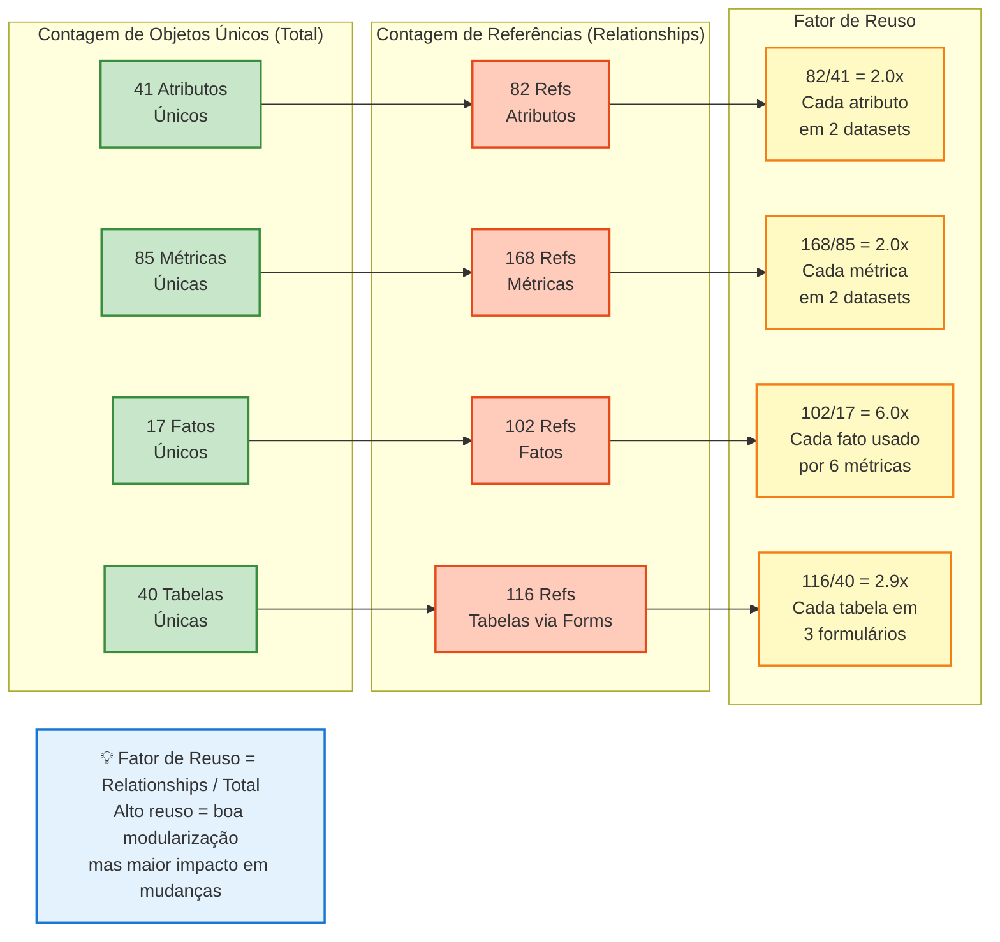
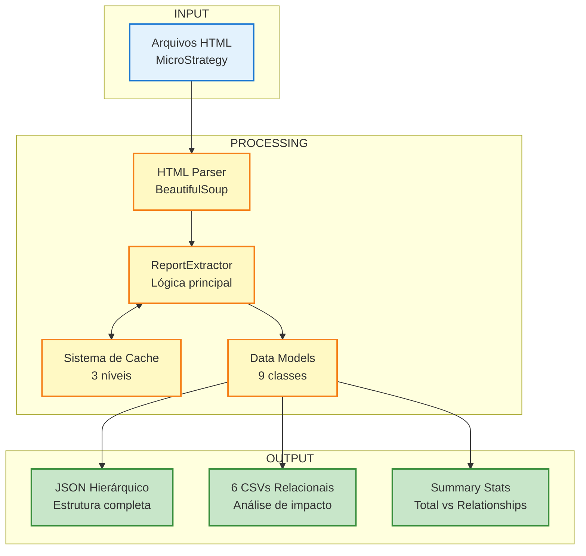
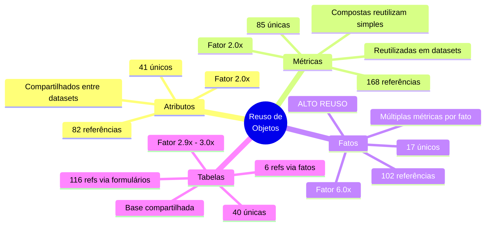
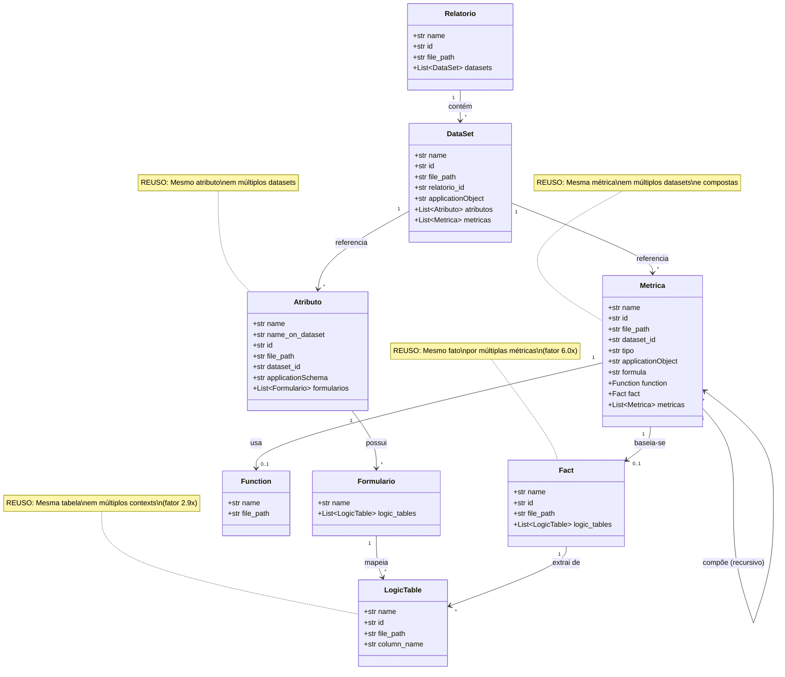

# MicroStrategy Report Data Model Extractor

Sistema de extração e análise de modelos de dados a partir de documentação HTML do MicroStrategy. Este projeto permite extrair relacionamentos complexos entre relatórios, datasets, atributos, métricas e tabelas fonte.

## 📋 Índice

- [Visão Geral](#visão-geral)
- [Arquitetura](#arquitetura)
- [Modelo de Dados](#modelo-de-dados)
- [Instalação](#instalação)
- [Uso](#uso)
- [Formatos de Saída](#formatos-de-saída)
- [Exemplos](#exemplos)
- [Detalhes Técnicos](#detalhes-técnicos)

---

## 🎯 Visão Geral

Este projeto analisa arquivos HTML exportados do MicroStrategy para construir um modelo de dados completo, mapeando todos os relacionamentos entre:

- **Relatórios** e seus **DataSets**
- **DataSets** e seus **Atributos** e **Métricas**
- **Atributos** e seus **Formulários** e **Tabelas Fonte**
- **Métricas Simples** e seus **Fatos** e **Tabelas Fonte**
- **Métricas Compostas** e suas **Métricas Componentes**

### Características Principais

- ✅ Extração automática de hierarquias complexas
- ✅ Suporte a métricas simples e compostas
- ✅ Resolução de tabelas fonte via Facts e Atributos
- ✅ Tratamento de problemas de encoding (acentos)
- ✅ Cache inteligente para otimização de performance
- ✅ Detecção e prevenção de referências circulares
- ✅ Exportação em JSON e CSV
- ✅ Suporte para extração de relatório específico ou todos os relatórios

---

## 🏗️ Arquitetura

### Estrutura de Arquivos

```
.
├── main.py                 # Ponto de entrada da aplicação
├── extractor.py            # Lógica principal de extração
├── html_parser.py          # Utilitários para parsing de HTML
├── models.py               # Modelos de dados (dataclasses)
├── output.py               # Formatação e exportação de dados
├── requirements.txt        # Dependências do projeto
└── README.md              # Documentação

RAW_DATA/                   # Diretório com arquivos HTML do MicroStrategy
├── Documento.html          # Índice de relatórios
├── CuboInteligente.html    # Índice de cubos inteligentes
├── Métrica.html            # Índice de métricas
├── Atributo.html           # Índice de atributos
├── Fato.html               # Índice de fatos
├── Função.html             # Índice de funções
├── TabelaLógica.html       # Índice de tabelas lógicas
└── [outros arquivos HTML com dados específicos]

output_csv/                 # CSVs gerados (relacionamentos)
├── relatorio_datasets.csv
├── dataset_atributos.csv
├── dataset_metricas.csv
├── metrica_metrica.csv
├── metrica_logic_table.csv
└── atributo_formulario_logic_table.csv

output.json                 # JSON gerado (estrutura hierárquica completa)
```

### Diagrama de Fluxo de Extração

```mermaid
flowchart TD
    Start([Início]) --> CLI[main.py<br/>Parse argumentos CLI]
    CLI --> ValidPath{base-path<br/>existe?}
    ValidPath -->|Não| Error1[Erro: Path inválido]
    ValidPath -->|Sim| CheckDoc{Documento.html<br/>existe?}
    CheckDoc -->|Não| Error2[Erro: Documento não encontrado]
    CheckDoc -->|Sim| InitExtractor[Inicializa ReportExtractor<br/>Cria caches vazios]
    
    InitExtractor --> CheckMode{Modo de<br/>extração?}
    CheckMode -->|Específico| FindReport[Busca relatório<br/>em Documento.html]
    CheckMode -->|Todos| ListReports[Lista todos relatórios<br/>em Documento.html]
    
    FindReport --> ProcessReport[Processa 1 Relatório]
    ListReports --> LoopReports[Loop por<br/>cada relatório]
    LoopReports --> ProcessReport
    
    ProcessReport --> ExtractDatasets[Extrai DataSets<br/>da seção DOCUMENT DEFINITION]
    ExtractDatasets --> ResolveDS[Resolve link do DataSet<br/>em CuboInteligente.html]
    
    ResolveDS --> ExtractTemplate[Extrai OBJETOS DE TEMPLATE<br/>LINHAS: Atributos<br/>COLUNAS: Métricas]
    
    ExtractTemplate --> ProcessAttr[Processa Atributos]
    ExtractTemplate --> ProcessMetric[Processa Métricas]
    
    ProcessAttr --> CheckAttrCache{Atributo<br/>no cache?}
    CheckAttrCache -->|Sim| ReuseAttr[Retorna cópia do cache<br/>🔄 REUSO]
    CheckAttrCache -->|Não| ResolveAttr[Resolve em Atributo.html]
    ResolveAttr --> ExtractForms[Extrai DETALHES DOS<br/>FORMULÁRIOS DE ATRIBUTO]
    ExtractForms --> ExtractFormTables[Para cada formulário:<br/>extrai LogicTables]
    ExtractFormTables --> CacheAttr[Adiciona ao cache]
    CacheAttr --> ReuseAttr
    
    ProcessMetric --> CheckMetricCache{Métrica<br/>no cache?}
    CheckMetricCache -->|Sim| ReuseMetric[Retorna cópia do cache<br/>🔄 REUSO]
    CheckMetricCache -->|Não| ResolveMetric[Resolve em Métrica.html]
    ResolveMetric --> ExtractMetricDef[Extrai DEFINIÇÃO<br/>Tipo + Fórmula]
    
    ExtractMetricDef --> CheckType{Tipo de<br/>métrica?}
    CheckType -->|Simples| ExtractFunction[Extrai Function<br/>ex: Sum, Avg]
    CheckType -->|Composta| ExtractComponents[Extrai métricas<br/>componentes]
    
    ExtractFunction --> ExtractFact[Extrai Fact<br/>do Fato.html]
    ExtractFact --> ExtractFactTables[Extrai EXPRESSÕES<br/>do Fact]
    ExtractFactTables --> FactToTables[Mapeia Fact<br/>para LogicTables]
    FactToTables --> CacheMetric[Adiciona ao cache]
    
    ExtractComponents --> RecursiveMetric[Recursivo:<br/>Processa cada<br/>métrica componente]
    RecursiveMetric --> CheckCircular{Referência<br/>circular?}
    CheckCircular -->|Sim| SkipCircular[⚠️ Skip para evitar<br/>loop infinito]
    CheckCircular -->|Não| ProcessMetric
    ExtractComponents --> CacheMetric
    
    CacheMetric --> ReuseMetric
    ReuseAttr --> BuildStructure[Monta estrutura<br/>hierárquica]
    ReuseMetric --> BuildStructure
    
    BuildStructure --> MoreReports{Mais<br/>relatórios?}
    MoreReports -->|Sim| LoopReports
    MoreReports -->|Não| GenerateSummary[Gera Summary<br/>com contadores únicos]
    
    GenerateSummary --> CountUnique[Conta IDs únicos<br/>usando Sets]
    CountUnique --> CountRefs[Conta todas referências<br/>incluindo reusos]
    CountRefs --> CalcReuse[Calcula fatores<br/>de reuso]
    
    CalcReuse --> ExportCheck{Exportar?}
    ExportCheck -->|JSON| ExportJSON[Export para JSON<br/>Estrutura hierárquica]
    ExportCheck -->|CSV| ExportCSV[Export para CSV<br/>6 arquivos relacionais]
    ExportCheck -->|Nenhum| PrintSummary[Exibe apenas Summary]
    
    ExportJSON --> PrintSummary
    ExportCSV --> PrintSummary
    PrintSummary --> End([Fim])
    
    Error1 --> End
    Error2 --> End
    SkipCircular --> BuildStructure
    
    %% Estilos
    classDef processClass fill:#e3f2fd,stroke:#1976d2,stroke-width:2px
    classDef decisionClass fill:#fff9c4,stroke:#f57f17,stroke-width:2px
    classDef cacheClass fill:#c8e6c9,stroke:#388e3c,stroke-width:2px
    classDef errorClass fill:#ffcdd2,stroke:#c62828,stroke-width:2px
    classDef reuseClass fill:#f8bbd0,stroke:#c2185b,stroke-width:3px
    
    class InitExtractor,ProcessReport,ExtractDatasets,ExtractTemplate,ResolveAttr,ResolveMetric processClass
    class ValidPath,CheckDoc,CheckMode,CheckAttrCache,CheckMetricCache,CheckType,CheckCircular,MoreReports,ExportCheck decisionClass
    class CacheAttr,CacheMetric,ReuseAttr,ReuseMetric,CountUnique cacheClass
    class Error1,Error2,SkipCircular errorClass
    class ReuseAttr,ReuseMetric reuseClass
```



**Legenda do Fluxo:**
- 🟦 **Azul:** Processos de extração
- 🟨 **Amarelo:** Decisões/validações
- 🟩 **Verde:** Operações de cache/reuso
- 🟥 **Vermelho:** Erros/problemas
- 🌸 **Rosa com borda grossa:** Pontos de reuso de objetos

### Componentes Principais

#### 1. `main.py`
- Interface CLI com `argparse`
- Configuração de logging
- Orquestração do fluxo de extração
- Validação de entrada e saída

#### 2. `extractor.py` - `ReportExtractor`
Classe principal que coordena a extração:
- `extract_report(report_name)`: Extrai um relatório específico
- `extract_all_reports()`: Extrai todos os relatórios
- `_extract_dataset()`: Extrai datasets e seus componentes
- `_extract_attribute()`: Extrai atributos com formulários e tabelas
- `_extract_metric()`: Extrai métricas (simples ou compostas) recursivamente

**Características Importantes:**
- Cache de arquivos parseados (`_parsed_files`)
- Cache de métricas e atributos para evitar reprocessamento
- Detecção de referências circulares em métricas compostas
- Resolução de links via índices HTML

#### 3. `html_parser.py`
Funções utilitárias para parsing de HTML:
- `parse_html_file()`: Parsing com múltiplos encodings
- `find_object_section()`: Localiza seções via comentários HTML
- `extract_datasets_from_report()`: Extrai datasets de um relatório
- `extract_template_objects()`: Extrai atributos (LINHAS) e métricas (COLUNAS)
- `extract_metric_definition()`: Extrai tipo, fórmula, função e fato
- `extract_attribute_forms()`: Extrai formulários de atributos
- `extract_fact_logic_tables()`: Extrai tabelas fonte de fatos
- `find_*_link()`: Funções para resolver links nos índices

**Tratamento de Encoding:**
- Normalização de texto para comparação
- Remoção de acentos para matching robusto
- Suporte a múltiplos encodings (ISO-8859-1, Latin-1, UTF-8)

#### 4. `models.py`
Definições dos modelos de dados usando `@dataclass`:
- `Relatorio`: Representa um relatório/documento
- `DataSet`: Representa um dataset (cubo inteligente ou relatório)
- `Atributo`: Atributo com formulários
- `Formulario`: Formulário de atributo com expressão e tabelas
- `Metrica`: Métrica (simples ou composta)
- `Function`: Função aplicada em métrica simples
- `Fact`: Fato com tabelas fonte
- `LogicTable`: Tabela lógica fonte

#### 5. `output.py`
Formatação e exportação:
- `export_to_json()`: Exporta estrutura hierárquica completa
- `export_to_csv()`: Exporta relacionamentos em múltiplos CSVs
- `print_summary()`: Exibe resumo estatístico
- `generate_relationship_summary()`: Calcula estatísticas usando IDs únicos

---

## 📊 Modelo de Dados

### Estrutura de Grafo com Reuso de Objetos

**IMPORTANTE:** O modelo de dados não é uma hierarquia estrita, mas sim um **grafo** onde objetos podem ser **reutilizados** em diferentes contextos:

- Um mesmo **Atributo** pode aparecer em múltiplos **DataSets**
- Uma mesma **Métrica** pode aparecer em múltiplos **DataSets** 
- Uma mesma **Tabela** pode ser referenciada por múltiplos **Formulários** e **Fatos**
- Um mesmo **Fato** pode ser usado por múltiplas **Métricas**

Por isso, o resumo estatístico mostra:
- **Totais (Total):** Contagem de objetos **únicos** (por ID) no sistema inteiro
- **Relationships:** Contagem de **todas as referências**, incluindo reusos

**Exemplo:** 
- `Total Attributes: 41` = 41 atributos únicos existem
- `DataSet -> Attributes: 82` = 82 referências (alguns atributos aparecem em 2+ datasets)

### Diagrama da Estrutura de Grafo



**Observações sobre o Diagrama:**
- **Linhas Sólidas (─────):** Relacionamentos hierárquicos ou de referência direta
- **Linhas Tracejadas (- - - -):** Composição de métricas (métricas dentro de métricas)
- **🔄 REUTILIZADO:** Indica objetos que aparecem em múltiplos contextos
- **N:M REUSO:** Relacionamento muitos-para-muitos com reuso (mesma instância em vários lugares)
- **Caixas com borda tracejada (rosa):** Objetos que são compartilhados (alto reuso)

### Diagrama de Contagem: Total vs Relationships



### Estrutura Lógica de Armazenamento

```
Relatorio
├── name: str                    # Nome do relatório
├── id: str                      # ID único (anchor)
├── file_path: str              # Caminho para o arquivo HTML
└── datasets: List[DataSet]     # Lista de datasets (referências)
    
    DataSet
    ├── name: str                    # Nome do dataset
    ├── id: str                      # ID único
    ├── file_path: str              # Caminho para o arquivo HTML
    ├── relatorio_id: str           # ID do relatório pai
    ├── applicationObject: str      # "CuboInteligente" ou None
    ├── atributos: List[Atributo]   # Referências a atributos (LINHAS) - podem ser compartilhados
    └── metricas: List[Metrica]     # Referências a métricas (COLUNAS) - podem ser compartilhadas
        
        Atributo
        ├── name: str                     # Nome oficial (de Atributo.html)
        ├── name_on_dataset: str          # Nome como aparece no dataset
        ├── id: str                       # ID único
        ├── file_path: str               # Caminho para o arquivo HTML
        ├── dataset_id: str              # ID do dataset pai
        ├── applicationSchema: str       # "Atributo"
        └── formularios: List[Formulario] # Lista de formulários
            
            Formulario
            ├── name: str                      # Nome do formulário (ex: "ID", "Nome")
            └── logic_tables: List[LogicTable] # Referências a tabelas fonte (compartilhadas)
                
                LogicTable
                ├── name: str        # Nome da tabela (pode ser referenciada em múltiplos lugares)
                ├── id: str          # ID único
                ├── file_path: str   # Caminho para o arquivo HTML
                └── column_name: str # Nome da coluna SQL (ex: "CAG_BCRIA_DW") - OPCIONAL
        
        Metrica (tipo = 'simples')
        ├── name: str                # Nome da métrica (pode ser reutilizada em múltiplos datasets)
        ├── id: str                  # ID único
        ├── file_path: str          # Caminho para o arquivo HTML
        ├── dataset_id: str         # ID do dataset pai (contexto atual)
        ├── tipo: str               # "simples" ou "composto"
        ├── applicationObject: str  # "Metrica"
        ├── formula: str            # Fórmula da métrica
        ├── function: Function      # Função de agregação
        └── fact: Fact              # Referência a fato (pode ser compartilhado)
            
            Function
            ├── name: str        # Nome da função (ex: "Sum", "Avg")
            └── file_path: str  # Caminho para o arquivo HTML
            
            Fact
            ├── name: str                     # Nome do fato (pode ser reutilizado por múltiplas métricas)
            ├── id: str                       # ID único
            ├── file_path: str               # Caminho para o arquivo HTML
            └── logic_tables: List[LogicTable] # Referências a tabelas fonte (compartilhadas)
        
        Metrica (tipo = 'composto')
        ├── name: str                  # Nome da métrica (pode ser reutilizada em múltiplos datasets)
        ├── id: str                    # ID único
        ├── file_path: str            # Caminho para o arquivo HTML
        ├── dataset_id: str           # ID do dataset pai (contexto atual)
        ├── tipo: str                 # "composto"
        ├── applicationObject: str    # "Metrica"
        ├── formula: str              # Fórmula composta
        ├── function: None            # Não aplicável
        ├── fact: None                # Não aplicável
        └── metricas: List[Metrica]   # Referências a métricas componentes (recursivo, compartilhadas)
```

### Relacionamentos Extraídos e Padrão de Reuso

#### Tipos de Contadores no Resumo

O sistema gera dois tipos de estatísticas:

1. **Totais (Total)** - Contagem de objetos únicos por ID
   - `Total Reports`: Número de relatórios únicos
   - `Total DataSets`: Número de datasets únicos  
   - `Total Attributes`: Número de atributos únicos (independente de quantos datasets os usam)
   - `Total AttributesForm`: Número de formulários únicos (atributo_id:form_name)
   - `Total Metrics`: Número de métricas únicas (incluindo todas as aninhadas em compostas)
   - `Total Facts`: Número de fatos únicos
   - `Total Tables`: Número de tabelas lógicas únicas

2. **Relationships** - Contagem de todas as referências/usos
   - `Report -> DataSets`: Total de referências dataset (um relatório pode ter N datasets)
   - `DataSet -> Attributes`: Total de referências atributo (soma de atributos em cada dataset, COM REUSO)
   - `Attribute -> AttributeForm`: Total de formulários (soma de formulários por atributo)
   - `AttributeForm -> Tables`: Total de referências tabela via formulários (COM REUSO)
   - `DataSet -> Metrics`: Total de referências métrica (soma de métricas em cada dataset, COM REUSO)
   - `Metric -> Metrics`: Total de referências métrica-filho em compostas
   - `Metric -> Facts`: Total de referências fato (COM REUSO - mesmo fato usado por múltiplas métricas)
   - `Fact -> Tables`: Total de referências tabela via fatos (COM REUSO)

**Exemplo Real do Sumário:**
```
Total Attributes: 41          # 41 atributos únicos no sistema
DataSet -> Attributes: 82     # 82 referências total (alguns atributos estão em 2+ datasets)
```
Isso significa que, em média, cada atributo é usado em ~2 datasets.

#### Relacionamentos Detalhados

1. **Relatorio → DataSet** (1:N)
   - Um relatório pode ter múltiplos datasets
   - Cada dataset referenciado pertence a um relatório
   - Fonte: Seção "DOCUMENT DEFINITION" do relatório

2. **DataSet → Atributo** (N:M - com reuso)
   - Um dataset contém múltiplos atributos (dimensões, linhas)
   - **O mesmo atributo pode aparecer em múltiplos datasets**
   - Fonte: Seção "OBJETOS DE TEMPLATE" → coluna "LINHAS"

3. **DataSet → Metrica** (N:M - com reuso)
   - Um dataset contém múltiplas métricas (medidas, colunas)
   - **A mesma métrica pode aparecer em múltiplos datasets**
   - Fonte: Seção "OBJETOS DE TEMPLATE" → coluna "COLUNAS"

4. **Atributo → Formulario → LogicTable** (1:N:M)
   - Um atributo tem múltiplos formulários (ID, Nome, Descrição, etc.)
   - Cada formulário tem uma expressão SQL
   - Cada formulário pode referenciar múltiplas tabelas fonte
   - **A mesma tabela pode ser referenciada por múltiplos formulários**
   - Fonte: Seção "DETALHES DOS FORMULÁRIOS DE ATRIBUTO"

5. **Metrica (simples) → Function** (N:1)
   - Métrica simples usa uma função de agregação
   - Exemplos: Sum, Avg, Max, Min, Count
   - Fonte: Campo "Fórmula" na seção "DEFINIÇÃO"

6. **Metrica (simples) → Fact → LogicTable** (N:M:M - com reuso)
   - Métrica simples baseia-se em um fato
   - **O mesmo fato pode ser usado por múltiplas métricas**
   - Fato mapeia para tabelas fonte físicas
   - **A mesma tabela pode ser usada por múltiplos fatos**
   - Fonte: Campo "Fórmula" na seção "DEFINIÇÃO" → HREF para Fato
   - Tabelas extraídas da seção "EXPRESSÕES" do Fato

7. **Metrica (composta) → Metrica** (1:N - recursivo, com reuso)
   - Métrica composta combina outras métricas
   - Relacionamento recursivo (métrica pode conter outras compostas)
   - **A mesma métrica componente pode ser usada em múltiplas métricas compostas**
   - Fonte: Campo "Fórmula" na seção "DEFINIÇÃO" (links para outras métricas)

### Tipos de Métrica

#### Métrica Simples
- Aplica uma função de agregação sobre um fato
- Estrutura: `Function(Fact)` → Exemplo: `Sum(VL_RESS)`
- Resolve até tabelas fonte via Fact
- **Pode ser reutilizada em múltiplos datasets e compostas**

#### Métrica Composta
- Combina outras métricas usando operações matemáticas
- Estrutura: `Metric1 OP Metric2` → Exemplo: `Vl. Ressarcimento / Vl. Despesa`
- Pode ter múltiplos níveis de composição
- Métricas componentes podem ser simples ou compostas
- **Pode ser reutilizada em múltiplos datasets e outras compostas**

### Como Funciona o Reuso de Objetos

#### Armazenamento em Memória

Durante a extração, o sistema armazena objetos de forma **hierárquica** (cada dataset tem suas listas), mas a **contagem** de objetos únicos é feita por ID:

```python
# No DataSet
dataset.atributos = [Atributo1, Atributo2, Atributo1]  # Atributo1 aparece 2x
dataset.metricas = [Metrica1, Metrica2]

# No Resumo
Total Attributes: 2  # Apenas Atributo1 e Atributo2 (IDs únicos)
DataSet -> Attributes: 3  # 3 referências (Atributo1 contado 2x)
```

#### Sistema de Cache

O extractor (`extractor.py`) utiliza caches para evitar reprocessamento:

```python
self._metric_cache: Dict[str, Metrica] = {}      # Cache de métricas por ID
self._attribute_cache: Dict[str, Atributo] = {}  # Cache de atributos por ID
```

Quando uma métrica ou atributo é solicitado novamente:
1. Sistema verifica se já existe no cache
2. Se existe, retorna uma **nova instância** com os mesmos dados
3. Isso permite que o mesmo objeto apareça em múltiplos contextos

#### Prevenção de Loops Infinitos

Para métricas compostas com referências circulares:

```python
def _extract_metric(self, ..., visited_ids: Set[str]):
    if metrica_id in visited_ids:
        return None  # Já estamos processando esta métrica
    visited_ids.add(metrica_id)
    # ... extração ...
    visited_ids.discard(metrica_id)
```

#### Implicações para Análise de Dados

1. **CSV vs JSON:**
   - **CSVs:** Mostram TODAS as referências (com repetições) - ideal para análise de impacto
   - **JSON:** Mostra estrutura hierárquica (com objetos repetidos em diferentes contextos)

2. **Análise de Impacto:**
   - Se uma tabela é usada por 10 formulários diferentes, ela aparecerá 10 vezes em `atributo_formulario_logic_table.csv`
   - Isso é CORRETO - mostra todos os pontos de uso

3. **Contagem de Objetos:**
   - Use `Total Tables: 40` para saber quantas tabelas únicas existem
   - Use `AttributeForm -> Tables: 116` para saber quantas referências existem
   - Razão: 116/40 = ~2.9 referências por tabela em média

---

## 🚀 Instalação

### Requisitos

- Python 3.8 ou superior
- pip (gerenciador de pacotes Python)

### Passo a Passo

```bash
# Clone ou baixe o projeto
cd /caminho/para/o/projeto

# Instale as dependências
pip install -r requirements.txt

# Verifique a instalação
python main.py --help
```

### Dependências

O projeto utiliza apenas bibliotecas leves:

```txt
beautifulsoup4>=4.12.0    # Parsing de HTML
lxml>=4.9.0               # Parser XML/HTML rápido
```

---

## 💻 Uso

### Sintaxe Básica

```bash
python main.py --base-path <caminho_html> [opções]
```

### Parâmetros

| Parâmetro | Obrigatório | Descrição |
|-----------|-------------|-----------|
| `--base-path` | ✅ Sim | Caminho para o diretório contendo os arquivos HTML |
| `--report` | ❌ Não | Nome do relatório específico a extrair. Se omitido, extrai todos |
| `--output-json` | ❌ Não | Caminho para salvar o arquivo JSON de saída |
| `--output-csv-dir` | ❌ Não | Diretório para salvar os arquivos CSV de saída |
| `--verbose` `-v` | ❌ Não | Ativa logging detalhado (modo debug) |

### Casos de Uso

#### 1. Extrair Relatório Específico (JSON)

```bash
python main.py \
  --base-path "RAW_DATA/04 - Relatórios Gerenciais - BARE (20250519221644)" \
  --report "04.10.043 - Resultado Comercial - Líderes" \
  --output-json output.json
```

**Resultado:**
- Arquivo `output.json` com estrutura hierárquica completa
- Resumo no console mostrando estatísticas

#### 2. Extrair Todos os Relatórios (JSON + CSV)

```bash
python main.py \
  --base-path "RAW_DATA/04 - Relatórios Gerenciais - BARE (20250519221644)" \
  --output-json output.json \
  --output-csv-dir output_csv
```

**Resultado:**
- Arquivo `output.json` com todos os relatórios
- Diretório `output_csv/` com 6 arquivos CSV de relacionamentos
- Resumo consolidado no console

#### 3. Modo Verbose (Debug)

```bash
python main.py \
  --base-path "RAW_DATA/04 - Relatórios Gerenciais - BARE (20250519221644)" \
  --report "04.10.043 - Resultado Comercial - Líderes" \
  --output-json output.json \
  --verbose
```

**Resultado:**
- Logs detalhados de cada etapa da extração
- Avisos sobre arquivos não encontrados
- Informações sobre resolução de links

#### 4. Apenas Visualizar Resumo (sem exportar)

```bash
python main.py \
  --base-path "RAW_DATA/04 - Relatórios Gerenciais - BARE (20250519221644)" \
  --report "04.10.043 - Resultado Comercial - Líderes"
```

**Resultado:**
- Resumo estatístico no console
- Nenhum arquivo exportado

---

## 📤 Formatos de Saída

### JSON Output

Estrutura hierárquica completa preservando todos os relacionamentos.

**Estrutura:**

```json
{
  "relatorios": [
    {
      "name": "04.10.043 - Resultado Comercial - Líderes",
      "id": "D8C7F01F4650B3CBC97AB991C79FB9DF",
      "file_path": "0_25.html#D8C7F01F4650B3CBC97AB991C79FB9DF",
      "datasets": [
        {
          "name": "DT_BARE_RESULT_COML",
          "id": "C8DB6F3D44BDF8C0BEFD63A8C2DAADEF",
          "file_path": "1_25.html#C8DB6F3D44BDF8C0BEFD63A8C2DAADEF",
          "applicationObject": "CuboInteligente",
          "atributos": [
            {
              "name": "Agência",
              "name_on_dataset": "Agência",
              "id": "8D679D4411D3E4981000E787EC6DE8A4",
              "file_path": "1_8.html#8D679D4411D3E4981000E787EC6DE8A4",
              "applicationSchema": "Atributo",
              "formularios": [
                {
                  "name": "ID",
                  "logic_tables": [
                    {
                      "name": "LU_BARE_AGE",
                      "id": "D93D7E614A4FCD869D84E5A50B8C28F6",
                      "file_path": "1_68.html#D93D7E614A4FCD869D84E5A50B8C28F6",
                      "column_name": "CAG_BCRIA_DW"
                    }
                  ]
                },
                {
                  "name": "Codigo Agência",
                  "logic_tables": [
                    {
                      "name": "LU_BARE_AGE",
                      "id": "D93D7E614A4FCD869D84E5A50B8C28F6",
                      "file_path": "1_68.html#D93D7E614A4FCD869D84E5A50B8C28F6",
                      "column_name": "COD_AGE"
                    }
                  ]
                },
                {
                  "name": "Nome Agência",
                  "logic_tables": [
                    {
                      "name": "LU_BARE_AGE",
                      "id": "D93D7E614A4FCD869D84E5A50B8C28F6",
                      "file_path": "1_68.html#D93D7E614A4FCD869D84E5A50B8C28F6",
                      "column_name": "DSC_AGE"
                    }
                  ]
                }
              ]
            }
          ],
          "metricas": [
            {
              "name": "Vl. Ressarcimento",
              "id": "0E89338F4A33BE4ED63FFDAD3CD7F1FD",
              "file_path": "1_62.html#0E89338F4A33BE4ED63FFDAD3CD7F1FD",
              "applicationObject": "Metrica",
              "tipo": "simples",
              "formula": "Sum (VL_RESS)",
              "function": {
                "name": "Sum",
                "file_path": "1_3.html#8107C317DD9911D3B98100C04F2233EA"
              },
              "fact": {
                "name": "Vl. Ressarcimento",
                "id": "D01D23FC41D6A35DBB2C3AA8A4C9E3CE",
                "file_path": "1_52.html#D01D23FC41D6A35DBB2C3AA8A4C9E3CE",
                "logic_tables": [
                  {
                    "name": "FT_BARE_RESULT_COML",
                    "id": "41DD7B954B32B4FA0B2A3691BF92BB43",
                    "file_path": "1_68.html#41DD7B954B32B4FA0B2A3691BF92BB43"
                  }
                ]
              },
              "metricas": []
            },
            {
              "name": "Margem de Ressarcimento %",
              "id": "A1B2C3D4E5F67890ABCDEF1234567890",
              "file_path": "1_62.html#A1B2C3D4E5F67890ABCDEF1234567890",
              "applicationObject": "Metrica",
              "tipo": "composto",
              "formula": "Vl. Ressarcimento / Vl. Despesa",
              "metricas": [
                {
                  "name": "Vl. Ressarcimento",
                  "id": "0E89338F4A33BE4ED63FFDAD3CD7F1FD",
                  "tipo": "simples",
                  "formula": "Sum (VL_RESS)",
                  "function": { "name": "Sum", "file_path": "..." },
                  "fact": {
                    "name": "Vl. Ressarcimento",
                    "id": "D01D23FC41D6A35DBB2C3AA8A4C9E3CE",
                    "logic_tables": [ { "name": "FT_BARE_RESULT_COML", ... } ]
                  },
                  "metricas": []
                },
                {
                  "name": "Vl. Despesa",
                  "id": "1F23456789ABCDEF0123456789ABCDEF",
                  "tipo": "simples",
                  "formula": "Sum (VL_DESP)",
                  "function": { "name": "Sum", "file_path": "..." },
                  "fact": {
                    "name": "Vl. Despesa",
                    "id": "E12D34FC41D6A35DBB2C3AA8A4C9E3CF",
                    "logic_tables": [ { "name": "FT_BARE_RESULT_COML", ... } ]
                  },
                  "metricas": []
                }
              ]
            }
          ]
        }
      ]
    }
  ],
  "summary": {
    "total_reports": 1,
    "total_datasets": 1,
    "total_attributes": 15,
    "total_attributesform": 45,
    "total_metrics": 25,
    "total_metrics_simples": 20,
    "total_metrics_compostas": 5,
    "total_facts": 20,
    "total_tables": 8,
    "relationships": {
      "report_datasets": 1,
      "dataset_attributes": 15,
      "attribute_attributeform": 45,
      "attributeform_tables": 45,
      "dataset_metrics": 25,
      "metric_metrics": 12,
      "metric_facts": 20,
      "fact_tables": 20
    }
  }
}
```

### CSV Outputs

Seis arquivos CSV são gerados, cada um representando um tipo de relacionamento:

#### 1. `relatorio_datasets.csv`
Relacionamento: **Relatorio → DataSet**

```csv
relatorio_id,relatorio_name,dataset_id,dataset_name
D8C7F01F4650B3CBC97AB991C79FB9DF,04.10.043 - Resultado Comercial - Líderes,C8DB6F3D44BDF8C0BEFD63A8C2DAADEF,DT_BARE_RESULT_COML
```

**Uso:** Identificar quais datasets pertencem a cada relatório.

#### 2. `dataset_atributos.csv`
Relacionamento: **DataSet → Atributo**

```csv
dataset_id,dataset_name,atributo_id,atributo_name,atributo_name_on_dataset,formularios_count
C8DB6F3D44BDF8C0BEFD63A8C2DAADEF,DT_BARE_RESULT_COML,8D679D4411D3E4981000E787EC6DE8A4,Agência,Agência,3
```

**Uso:** Listar atributos de cada dataset com contagem de formulários.

#### 3. `dataset_metricas.csv`
Relacionamento: **DataSet → Metrica → Fact → LogicTable**

```csv
dataset_id,dataset_name,metrica_id,metrica_name,tipo,fact_id,fact_name,logic_table_name,logic_table_id
C8DB6F3D44BDF8C0BEFD63A8C2DAADEF,DT_BARE_RESULT_COML,0E89338F4A33BE4ED63FFDAD3CD7F1FD,Vl. Ressarcimento,simples,D01D23FC41D6A35DBB2C3AA8A4C9E3CE,Vl. Ressarcimento,FT_BARE_RESULT_COML,41DD7B954B32B4FA0B2A3691BF92BB43
```

**Uso:** Listar métricas de cada dataset, seus fatos e tabelas fonte (uma linha por tabela).

#### 4. `metrica_metrica.csv`
Relacionamento: **Metrica (composta) → Metrica (componente)**

```csv
parent_metrica_id,parent_metrica_name,child_metrica_id,child_metrica_name
A1B2C3D4E5F67890ABCDEF1234567890,Margem de Ressarcimento %,0E89338F4A33BE4ED63FFDAD3CD7F1FD,Vl. Ressarcimento
A1B2C3D4E5F67890ABCDEF1234567890,Margem de Ressarcimento %,1F23456789ABCDEF0123456789ABCDEF,Vl. Despesa
```

**Uso:** Mapear composição de métricas compostas (quais métricas usam quais outras).

#### 5. `metrica_logic_table.csv`
Relacionamento: **Metrica → Fact → LogicTable**

```csv
metrica_id,metrica_name,fact_id,fact_name,logic_table_name,logic_table_id
0E89338F4A33BE4ED63FFDAD3CD7F1FD,Vl. Ressarcimento,D01D23FC41D6A35DBB2C3AA8A4C9E3CE,Vl. Ressarcimento,FT_BARE_RESULT_COML,41DD7B954B32B4FA0B2A3691BF92BB43
```

**Uso:** Rastrear de qual(is) tabela(s) física(s) uma métrica obtém dados.

#### 6. `atributo_formulario_logic_table.csv`
Relacionamento: **Atributo → Formulario → LogicTable**

```csv
atributo_id,atributo_name,formulario_name,logic_table_name,logic_table_id,column_name
8D679D4411D3E4981000E787EC6DE8A4,Agência,ID,LU_BARE_AGE,D93D7E614A4FCD869D84E5A50B8C28F6,CAG_BCRIA_DW
8D679D4411D3E4981000E787EC6DE8A4,Agência,Codigo Agência,LU_BARE_AGE,D93D7E614A4FCD869D84E5A50B8C28F6,COD_AGE
8D679D4411D3E4981000E787EC6DE8A4,Agência,Nome Agência,LU_BARE_AGE,D93D7E614A4FCD869D84E5A50B8C28F6,DSC_AGE
```

**Uso:** Identificar formulários de atributos, suas colunas SQL (column_name) e tabelas fonte.

**Nota:** O campo `column_name` contém a coluna SQL específica da tabela (ex: "CAG_BCRIA_DW", "COD_AGE", "DSC_AGE").

---

## 📚 Exemplos

### Exemplo 1: Análise de Impacto de Tabela

**Cenário:** Você precisa saber quais relatórios serão afetados se a tabela `FT_BARE_RESULT_COML` for alterada.

**Solução:**

```bash
# 1. Extrair todos os relatórios
python main.py \
  --base-path "RAW_DATA/04 - Relatórios Gerenciais - BARE (20250519221644)" \
  --output-csv-dir output_csv

# 2a. Buscar métricas que usam essa tabela
grep "FT_BARE_RESULT_COML" output_csv/metrica_logic_table.csv

# 2b. Buscar atributos que usam essa tabela  
grep "FT_BARE_RESULT_COML" output_csv/atributo_formulario_logic_table.csv

# 3. Cruzar IDs das métricas com dataset_metricas.csv
# 4. Cruzar IDs dos datasets com relatorio_datasets.csv
```

**Resultado:** 
- Lista completa de métricas e atributos afetados
- Todos os datasets que os utilizam (com reuso)
- Todos os relatórios impactados
- **Nota:** A mesma métrica pode aparecer múltiplas vezes se estiver em vários datasets

### Exemplo 2: Documentação de Métrica Composta

**Cenário:** Documentar a composição da métrica "Margem de Ressarcimento %".

**Solução:**

```bash
# 1. Extrair relatório específico em JSON
python main.py \
  --base-path "RAW_DATA/04 - Relatórios Gerenciais - BARE (20250519221644)" \
  --report "04.10.043 - Resultado Comercial - Líderes" \
  --output-json output.json

# 2. Analisar no JSON ou CSV
grep "Margem de Ressarcimento" output_csv/metrica_metrica.csv
```

**Resultado:**
```
Margem de Ressarcimento % = Vl. Ressarcimento / Vl. Despesa
  └─ Vl. Ressarcimento = Sum(VL_RESS) from FT_BARE_RESULT_COML
  └─ Vl. Despesa = Sum(VL_DESP) from FT_BARE_RESULT_COML
```

### Exemplo 3: Análise de Reuso de Métricas

**Cenário:** Identificar quais métricas são mais reutilizadas entre datasets.

**Solução:**

```bash
# 1. Extrair todos os relatórios
python main.py \
  --base-path "RAW_DATA/04 - Relatórios Gerenciais - BARE (20250519221644)" \
  --output-csv-dir output_csv

# 2. Contar quantos datasets usam cada métrica
cut -d',' -f3,4 output_csv/dataset_metricas.csv | sort | uniq -c | sort -rn | head -20
```

**Resultado:** 
- Top 20 métricas mais reutilizadas
- Número de vezes que cada uma aparece
- Métricas com alta contagem são candidatas para cache ou otimização

**Interpretação:**
```
5 A1B2C3D4,Vl. Ressarcimento    # Aparece em 5 datasets
3 E5F6G7H8,Margem %              # Aparece em 3 datasets  
1 I9J0K1L2,Métrica Específica   # Aparece em apenas 1 dataset
```

### Exemplo 4: Auditoria de Tabelas Fonte

**Cenário:** Listar todas as tabelas fonte usadas em um dataset específico.

**Solução:**

```bash
# 1. Extrair com CSV
python main.py \
  --base-path "RAW_DATA/04 - Relatórios Gerenciais - BARE (20250519221644)" \
  --output-csv-dir output_csv

# 2a. Tabelas via métricas
grep "DT_BARE_RESULT_COML" output_csv/metrica_logic_table.csv | cut -d',' -f5 | sort -u

# 2b. Tabelas via atributos
grep "DT_BARE_RESULT_COML" output_csv/atributo_formulario_logic_table.csv | cut -d',' -f5 | sort -u

# 3. Combinar e contar referências
grep "DT_BARE_RESULT_COML" output_csv/metrica_logic_table.csv | cut -d',' -f5 | sort | uniq -c
grep "DT_BARE_RESULT_COML" output_csv/atributo_formulario_logic_table.csv | cut -d',' -f5 | sort | uniq -c
```

**Resultado:** 
- Lista única de todas as tabelas usadas (via métricas e atributos)
- Contagem de quantas vezes cada tabela é referenciada
- Identificação de tabelas mais críticas (mais referências = maior impacto)

### Exemplo 5: Rastreamento de Atributo

**Cenário:** Verificar qual campo SQL representa o atributo "Agência".

**Solução:**

```bash
# 1. Extrair em JSON (mais legível para esse caso)
python main.py \
  --base-path "RAW_DATA/04 - Relatórios Gerenciais - BARE (20250519221644)" \
  --report "04.10.043 - Resultado Comercial - Líderes" \
  --output-json output.json

# 2. Buscar no JSON
jq '.relatorios[].datasets[].atributos[] | select(.name == "Agência") | .formularios' output.json
```

**Resultado:**
```json
[
  {
    "name": "ID",
    "expressao": "CAG_BCRIA_DW",
    "logic_tables": [{"name": "LU_BARE_AGE", ...}]
  },
  {
    "name": "Codigo Agência",
    "expressao": "COD_AGE",
    "logic_tables": [{"name": "LU_BARE_AGE", ...}]
  },
  {
    "name": "Nome Agência",
    "expressao": "DSC_AGE",
    "logic_tables": [{"name": "LU_BARE_AGE", ...}]
  }
]
```

---

## 🔧 Detalhes Técnicos

### Resolução de Links

O sistema utiliza índices HTML para resolver referências:

1. **Relatórios:** `Documento.html` → lista todos os relatórios
2. **Datasets:** `CuboInteligente.html` ou `Documento.html` → resolução via ID
3. **Atributos:** `Atributo.html` → busca por ID ou nome
4. **Métricas:** `Métrica.html` → busca por ID ou nome
5. **Fatos:** `Fato.html` → busca por ID
6. **Funções:** `Função.html` → busca por ID
7. **Tabelas:** `TabelaLógica.html` → busca por ID ou nome

### Extração de IDs

IDs são extraídos de HREFs no formato placeholder:
```html
<a href="arquivo.html#[$$$$A1B2C3D4E5F6$$$$]">Nome do Objeto</a>
```

Regex utilizada: `\[\$\$\$\$([A-F0-9]+)\$\$\$\$\]`

### Tratamento de Encoding

Arquivos HTML podem ter encoding inconsistente. O sistema:

1. Tenta múltiplos encodings: `ISO-8859-1`, `Latin-1`, `CP1252`, `UTF-8`
2. Normaliza texto para comparação (remove acentos)
3. Usa nomes oficiais dos índices HTML (preserva acentos corretos)

### Cache e Performance

#### Sistema de Cache Multinível

1. **Cache de Arquivos HTML** (`_parsed_files`)
   ```python
   self._parsed_files: Dict[str, BeautifulSoup] = {}
   ```
   - Evita parsing repetido do mesmo arquivo HTML
   - Mantido durante toda a execução
   - Key: caminho do arquivo

2. **Cache de Métricas** (`_metric_cache`)
   ```python
   self._metric_cache: Dict[str, Metrica] = {}
   ```
   - Evita reextração da mesma métrica
   - Key: `{metrica_id}:{metrica_name}`
   - Retorna **nova instância** (não referência compartilhada)
   - Permite que a mesma métrica apareça em múltiplos datasets

3. **Cache de Atributos** (`_attribute_cache`)
   ```python
   self._attribute_cache: Dict[str, Atributo] = {}
   ```
   - Evita reextração do mesmo atributo
   - Key: `{dataset_id}:{atributo_name}`
   - Retorna **nova instância** (não referência compartilhada)
   - Permite que o mesmo atributo apareça em múltiplos datasets

#### Contagem de Objetos Únicos

O sistema usa **Sets** para rastrear IDs únicos:

```python
unique_metrica_ids = set()          # IDs de todas as métricas (incluindo nested)
unique_atributo_ids = set()         # IDs de todos os atributos
unique_tabela_ids = set()           # IDs de todas as tabelas lógicas
```

**Processo de Contagem:**
1. Percorre TODAS as referências na estrutura hierárquica
2. Para cada objeto, verifica se o ID já foi visto (set)
3. Se novo, incrementa contador de "Total"
4. Sempre incrementa contador de "Relationships" (conta repetições)

**Exemplo:**
```python
# Métrica aparece em 3 datasets
for dataset in datasets:
    for metrica in dataset.metricas:
        if metrica.id not in unique_metrica_ids:
            unique_metrica_ids.add(metrica.id)
            total_metrics += 1              # Incrementa apenas 1x
        relationships['dataset_metrics'] += 1   # Incrementa 3x
```

#### Detecção de Loops

Previne recursão infinita em métricas compostas com referências circulares:

```python
def _extract_metric(self, ..., visited_ids: Set[str] = None):
    if metrica_id in visited_ids:
        logger.warning("Circular reference detected")
        return None  # Para a recursão
    
    visited_ids.add(metrica_id)
    # ... processar métrica ...
    
    # Processar métricas componentes (recursivo)
    for child_id in child_metric_ids:
        child_metric = self._extract_metric(..., visited_ids.copy())
    
    visited_ids.discard(metrica_id)  # Remove após processar
```

**Comportamento:**
- Usa set `visited_ids` para rastrear métricas sendo processadas
- Se encontra ID já em processamento → circular reference → retorna None
- Copia o set para cada branch recursiva (permite reuso em outros contextos)
- Remove ID após processar (permite processamento em outro contexto)

### Limitações Conhecidas

1. **Arquivos Índice Ausentes:**
   - Se `Métrica.html`, `Fato.html`, etc. não existirem, alguns relacionamentos não serão resolvidos
   - O sistema loga avisos e continua com dados parciais

2. **Encoding Complexo:**
   - Alguns caracteres especiais podem não ser reconhecidos corretamente
   - Nomes oficiais dos índices são sempre preferidos

3. **Métricas Muito Complexas:**
   - Fórmulas muito longas podem ter parsing incompleto
   - Estruturas aninhadas profundas podem ter recursão limitada

4. **Performance com Muitos Relatórios:**
   - Extrair todos os relatórios pode levar vários minutos dependendo do volume
   - Use `--report` para extrações específicas quando possível

5. **Reuso e Duplicação:**
   - JSON resultante pode ser grande devido à replicação de objetos compartilhados
   - Cada dataset contém cópias completas dos objetos (não apenas referências)
   - Para análise de objetos únicos, use o `summary` ou os contadores "Total"

6. **Contadores no Resumo:**
   - `Total Metrics` inclui TODAS as métricas (top-level + nested em compostas)
   - Para contar apenas métricas top-level, use `Total Metrics Simples + Total Metrics Compostas`
   - Diferença = métricas que aparecem apenas como componentes de outras

### Estrutura de Comentários HTML

O MicroStrategy usa comentários especiais para marcar seções:

```html
<!-- [OBJECT: Nome do Objeto] -->
```

Exemplos:
- `<!-- [OBJECT: Relatorio] -->`
- `<!-- [OBJECT: CuboInteligente] -->`
- `<!-- [OBJECT: Atributo] -->`
- `<!-- [OBJECT: Metrica] -->`

### Seções HTML Importantes

1. **DOCUMENT DEFINITION:** Lista de datasets do relatório
2. **OBJETOS DE TEMPLATE:** Atributos (LINHAS) e Métricas (COLUNAS)
3. **DEFINIÇÃO:** Tipo de métrica, fórmula, função, fato
4. **DETALHES DOS FORMULÁRIOS DE ATRIBUTO:** Formulários e tabelas fonte
5. **EXPRESSÕES:** Tabelas fonte de fatos

---

## 📝 Notas Finais

### Boas Práticas

1. **Sempre use IDs** quando disponíveis para matching preciso
2. **Execute com `--verbose`** para troubleshooting
3. **Mantenha backup** dos arquivos HTML originais
4. **Valide os CSVs** cruzando com dados conhecidos

5. **Entenda a Diferença entre Total e Relationships:**
   - `Total X` = objetos únicos (use para inventário)
   - `Relationship` = todas as referências (use para análise de impacto)
   - Razão `Relationship / Total` = fator de reuso médio

6. **Escolha o Formato Correto:**
   - **Use JSON** para:
     - Análises hierárquicas complexas
     - Navegação de composição de métricas
     - Exportação para outras ferramentas (APIs, etc.)
   - **Use CSVs** para:
     - Análise de impacto (quem usa o quê)
     - Identificação de reuso
     - Importação em Excel, SQL, Power BI, Tableau

7. **Análise de Reuso:**
   - Compare `Total` vs `Relationship` para identificar objetos compartilhados
   - Exemplo: Se `Total Metrics: 85` mas `DataSet -> Metrics: 168`, então métricas são muito reutilizadas (fator ~2x)
   - Alta reutilização = boa modularização, mas maior impacto em mudanças

8. **Análise de Impacto:**
   - Para mudanças em tabelas: busque em AMBOS `metrica_logic_table.csv` E `atributo_formulario_logic_table.csv`
   - Conte REFERÊNCIAS (não únicos) para ver impacto real
   - Tabela com muitas referências = alto risco de mudança

9. **Performance:**
   - Para grandes volumes, extraia relatórios específicos primeiro
   - Use cache - execute apenas uma vez e analise múltiplas vezes
   - CSVs são mais rápidos de processar que JSON para queries simples

### Manutenção

- **Adicionar Novos Tipos de Objetos:** Estenda `models.py` e `html_parser.py`
- **Novos Formatos de Saída:** Adicione funções em `output.py`
- **Melhorias de Parsing:** Modifique funções `extract_*` em `html_parser.py`

### Contribuindo

Se encontrar bugs ou tiver sugestões:
1. Documente o caso de uso
2. Forneça exemplos de HTML problemático
3. Descreva o comportamento esperado vs. atual

---

## 📄 Licença

Este projeto é fornecido "como está" para uso interno e análise de documentação MicroStrategy.

---

## 📐 Resumo Visual da Arquitetura

### Visão Geral do Sistema



### Padrões de Reuso Identificados



### Estrutura de Classes (models.py)



### Mudanças Recentes no Modelo de Dados

#### v1.1 - Atualização da Estrutura LogicTable

**O que mudou:**
- ✅ **Adicionado:** Campo `column_name` em `LogicTable`
- ❌ **Removido:** Campo `expressao` de `Formulario`

**Antes:**
```python
@dataclass
class Formulario:
    name: str
    expressao: str  # ❌ Removido
    logic_tables: List[LogicTable]

@dataclass
class LogicTable:
    name: str
    id: str
    file_path: str
```

**Agora:**
```python
@dataclass
class Formulario:
    name: str
    logic_tables: List[LogicTable]  # ✅ Simplificado

@dataclass
class LogicTable:
    name: str
    id: str
    file_path: str
    column_name: str  # ✅ Novo - nome da coluna SQL específica
```

**Por quê?**
- **Mais Preciso:** A coluna SQL (`column_name`) pertence à tabela, não ao formulário
- **Melhor Modelagem:** Um formulário pode referenciar múltiplas tabelas, cada uma com sua coluna específica
- **Maior Flexibilidade:** Permite mapear com precisão qual coluna de qual tabela é usada

**Impacto:**
- ✅ CSV `atributo_formulario_logic_table.csv` agora tem coluna `column_name`
- ✅ JSON tem `column_name` dentro de cada `LogicTable`
- ✅ Queries SQL mais precisas podem ser geradas automaticamente

**Exemplo Prático:**

Atributo "Agência" tem 3 formulários, todos usando a mesma tabela `LU_BARE_AGE` mas colunas diferentes:

| Formulário | Tabela | Column Name |
|------------|--------|-------------|
| ID | LU_BARE_AGE | CAG_BCRIA_DW |
| Codigo Agência | LU_BARE_AGE | COD_AGE |
| Nome Agência | LU_BARE_AGE | DSC_AGE |

Isso permite gerar SQL automaticamente:
```sql
SELECT 
    agen.CAG_BCRIA_DW as "ID",
    agen.COD_AGE as "Codigo Agência", 
    agen.DSC_AGE as "Nome Agência"
FROM LU_BARE_AGE agen
```

---

## 🔍 Entendendo o Resumo de Extração

Quando você executa o extractor, o resumo mostra:

```
EXTRACTION SUMMARY (UNIQUE IDs)
============================================================
Total Reports: 1
Total DataSets: 2
Total Attributes: 41
Total AttributesForm: 14
Total Metrics: 85
  - Simples: 51
  - Compostas: 33
Total Facts: 17
Total Tables: 40

Relationships:
  Report -> DataSets: 2
  DataSet -> Attributes: 82
  Attribute -> AttributeForm: 28
  AttributeForm -> Tables: 116
  DataSet -> Metrics: 168
  Metric -> Metrics: 116
  Metric -> Facts: 102
  Fact -> Tables: 6
```

### O Que Cada Linha Significa

**Totais (Objetos Únicos):**
- `Total Attributes: 41` → 41 atributos diferentes existem no sistema
- `Total Metrics: 85` → 85 métricas diferentes (incluindo nested em compostas)
  - `Simples: 51` → 51 métricas que usam fatos diretamente
  - `Compostas: 33` → 33 métricas que combinam outras métricas
  - Note: 51 + 33 = 84, mas Total = 85 → 1 métrica aparece APENAS como componente
- `Total Tables: 40` → 40 tabelas lógicas únicas no sistema

**Relationships (Todas as Referências):**
- `DataSet -> Attributes: 82` → 82 referências a atributos (41 únicos × ~2 datasets cada)
  - **Fator de reuso: 82/41 = 2.0** → cada atributo é usado em 2 datasets em média
- `DataSet -> Metrics: 168` → 168 referências a métricas (85 únicos × ~2 datasets cada)
  - **Fator de reuso: 168/85 ≈ 2.0** → cada métrica é usada em ~2 datasets em média
- `AttributeForm -> Tables: 116` → 116 referências a tabelas via formulários (40 únicas)
  - **Fator de reuso: 116/40 = 2.9** → cada tabela é referenciada por ~3 formulários
- `Metric -> Facts: 102` → 102 referências a fatos (17 únicos)
  - **Fator de reuso: 102/17 = 6.0** → cada fato é usado por ~6 métricas (muito reuso!)

### Interpretação

**Alta Reutilização = Boa Modularização, mas...**
- ✅ **Positivo:** Objetos bem modelados e reaproveitados
- ⚠️ **Atenção:** Mudanças afetam múltiplos lugares
- 📊 **Análise:** Use fator de reuso para priorizar testes de impacto

**Exemplo Prático:**
Se você mudar a definição de um **Fato** (fator 6.0), isso afetará ~6 métricas em média. Se essas métricas estão em múltiplos datasets (fator 2.0), o impacto real pode ser ~12 referências no sistema todo.

---

## 🆘 Suporte

Para dúvidas ou problemas:
1. Verifique os logs com `--verbose`
2. Confirme que `Documento.html` existe no `--base-path`
3. Verifique se os índices HTML (`Métrica.html`, `Atributo.html`, etc.) existem
4. Teste com um relatório específico primeiro antes de extrair todos
5. **Entenda os contadores:** Total = únicos, Relationships = todas as referências

**Resumo Rápido:**

```bash
# Instalação
pip install -r requirements.txt

# Uso Básico
python main.py --base-path "RAW_DATA/[seu_diretorio]" --output-json output.json --output-csv-dir output_csv

# Debug
python main.py --base-path "RAW_DATA/[seu_diretorio]" --report "Nome do Relatório" --verbose

# Análise de Reuso (após extração)
# Ver fator de reuso de métricas
echo "Fator de reuso = Relationships / Total"
```
