# MicroStrategy Data Model Extractor

Professional data extraction tool for parsing MicroStrategy HTML documentation and extracting complex relationships between reports, datasets, attributes, metrics, and source tables.

## Table of Contents

- [Installation](#installation)
- [How to Use](#how-to-use)
- [Commands / Scripts](#commands--scripts)
- [Project Structure](#project-structure)
- [Output Data Model (JSON Schema)](#output-data-model-json-schema)
- [Neo4j Integration](#neo4j-integration)
  - [Graph Model](#graph-model)
  - [Neo4j Scripts](#neo4j-scripts)
  - [Docker Setup](#docker-setup)

---

## How It Works

The MicroStrategy Data Model Extractor transforms MicroStrategy documentation into a queryable graph database through a simple 4-step process:

```mermaid
graph TD
    A[📊 MicroStrategy]
    A -->|Export| B[📄 HTML Files]
    
    B -->|Read with<br/>BeautifulSoup| C[🔍 Extractor<br/>mstr-extractor.py]
    
    C -->|Generate| D[📋 JSON Schema<br/>output.json]
    C -->|Load Data<br/>Optional| E[🗄️ Neo4j Database]
    
    style A fill:#e1f5ff,stroke:#0066cc,stroke-width:2px
    style B fill:#fff4e1,stroke:#ff9800,stroke-width:2px
    style C fill:#4caf50,stroke:#2e7d32,stroke-width:3px,color:#fff
    style D fill:#e8f5e9,stroke:#4caf50,stroke-width:2px
    style E fill:#fce4ec,stroke:#e91e63,stroke-width:2px
```



### Workflow Steps

**Phase 1: Export Documentation**
- 📊 **MicroStrategy** exports documentation as 📄 **HTML Files**
- Contains reports, metrics, attributes, facts, and relationships

**Phase 2: Extract, Parse and Load**
- 🔍 **Extractor** (`mstr-extractor.py`) reads HTML files using BeautifulSoup
- Extracts relationships between reports, datasets, metrics, attributes, facts, and tables
- Handles complex nested structures and recursive metric compositions

  - **2.1: JSON Output**
    - 📋 Generates structured **JSON Schema** (`output.json`) with complete data model
    - Includes all relationships and metadata
    - Ready for analysis or loading into Neo4j

  - **2.2: Database Load** *(Optional)*
    - 🗄️ Loads data into **Neo4j Database** for graph queries
    - Enables powerful graph queries and visualizations
    - Supports environment versioning and user access control

---

## Installation

### Prerequisites

- Python 3.8 or higher
- pip (Python package manager)
- MicroStrategy HTML documentation files

### Installation Steps

1. **Clone the repository:**

```bash
git clone <repository-url>
cd microstrategy-extractor
```

2. **Install dependencies:**

```bash
pip install -r requirements.txt
```

3. **Install the package:**

```bash
pip install -e .
```

### Requirements

```
beautifulsoup4>=4.12.0
lxml>=4.9.0
pyyaml>=6.0.0
pydantic>=2.0.0
neo4j>=5.15.0
python-dotenv>=1.0.0
tqdm>=4.66.0
```

---

## How to Use

### Configuration

#### Environment Variables (.env)

Create a `.env` file in the project root:

```bash
# Input path
BASE_PATH=RAW_DATA/04 - Relatórios Gerenciais - BARE (20250519221644)

# Output paths
OUTPUT_JSON=output.json

# Logging
LOG_LEVEL=INFO
VERBOSE=false
```

**Configuration Parameters:**

| Parameter | Description | Default | Valid Values |
|-----------|-------------|---------|--------------|
| `BASE_PATH` | Directory containing MicroStrategy HTML files | Required | Valid directory path |
| `OUTPUT_JSON` | Output JSON file path | `output.json` | Any .json file path |
| `LOG_LEVEL` | Logging verbosity | `INFO` | `DEBUG`, `INFO`, `WARNING`, `ERROR`, `CRITICAL` |
| `VERBOSE` | Enable detailed logs | `false` | `true`, `false` |

#### Running the Extractor

```python
# Basic usage
python mstr-extractor.py

# Or with explicit parameters
python mstr-extractor.py --base-path <path> --output-json output.json
```

---

## Commands / Scripts

### Main CLI Commands

**Extract all reports using the variables from .env:**
```bash
python mstr-extractor.py
```

**Extract all reports:**
```bash
python mstr-extractor.py --base-path <path> --output-json output.json
```

**Extract specific report by name:**
```bash
python mstr-extractor.py --base-path <path> --report "Report Name" --output-json output.json
```

**Extract report by ID:**
```bash
python mstr-extractor.py --base-path <path> --report-id "ABC123..." --output-json output.json
```

**Filter reports by pattern:**
```bash
python mstr-extractor.py --base-path <path> --filter "Boletim" --output-json output.json
```

**Enable verbose logging (debug mode):**
```bash
python mstr-extractor.py --base-path <path> --output-json output.json --verbose
```

**Use aggressive caching (faster, more RAM):**
```bash
python mstr-extractor.py --base-path <path> --output-json output.json --aggressive-cache
```

### Full Workflow Example

```bash
# 1. Extract all reports to JSON
python mstr-extractor.py \
  --base-path "RAW_DATA/04 - Relatórios Gerenciais - BARE (20250519221644)" \
  --output-json output.json \
  --verbose

# 2. (Optional) Load to Neo4j - See Neo4j Integration section for details
# Initialize schema (first time only)
python -m microstrategy_extractor.scripts.init_neo4j_schema

# Load data
python -m microstrategy_extractor.scripts.load_to_neo4j \
  --json-file output.json \
  --environment-id prod-2024-11 \
  --environment-name "Production"
```

**Note**: For complete Neo4j commands (initialization, loading, deletion, reset), see the [Neo4j Scripts](#neo4j-scripts) section.

---

## Project Structure

```
microstrategy-extractor/
├── src/
│   └── microstrategy_extractor/          # Main package
│       ├── core/                          # Core models, types, exceptions, constants
│       │   ├── constants.py               # Constants and enums
│       │   ├── exceptions.py              # Custom exceptions
│       │   ├── models.py                  # Data models (dataclasses)
│       │   └── types.py                   # Type definitions
│       │
│       ├── config/                        # Configuration management
│       │   └── settings.py                # Config class (env, CLI, code)
│       │
│       ├── cache/                         # Caching system
│       │   ├── cache_manager.py           # Abstract cache interface
│       │   └── memory_cache.py            # LRU cache implementation
│       │
│       ├── parsers/                       # HTML parsing
│       │   ├── base_parser.py             # Base parser class
│       │   ├── report_parser.py           # Report parsing
│       │   ├── metric_parser.py           # Metric parsing
│       │   ├── attribute_parser.py        # Attribute parsing
│       │   ├── fact_parser.py             # Fact parsing
│       │   └── link_resolver.py           # Link resolution
│       │
│       ├── extractors/                    # Data extraction
│       │   ├── base_extractor.py          # Base extractor class
│       │   ├── report_extractor.py        # Report extraction
│       │   ├── metric_extractor.py        # Metric extraction
│       │   ├── attribute_extractor.py     # Attribute extraction
│       │   ├── dataset_extractor.py       # Dataset extraction
│       │   ├── parallel_extractor.py      # Parallel processing
│       │   └── extractor_helpers.py       # Helper functions
│       │
│       ├── validators/                    # Data validation
│       │   └── data_validator.py          # Validators
│       │
│       ├── utils/                         # Utilities
│       │   ├── logger.py                  # Structured logging
│       │   └── text_normalizer.py         # Text normalization
│       │
│       ├── scripts/                       # Neo4j management scripts
│       │   ├── init_neo4j_schema.py       # Initialize Neo4j schema
│       │   ├── load_to_neo4j.py           # Load data to Neo4j
│       │   └── reset_neo4j.py             # Reset Neo4j database
│       │
│       └── exporters/                     # Data exporters
│           └── json_exporter.py           # JSON export functionality
│
├── docker-compose.yml                     # Neo4j Docker setup
├── mstr-extractor.py                      # Main CLI entry point
├── pyproject.toml                         # Project metadata and dependencies
├── requirements.txt                       # Python dependencies (pip)
└── README.md                              # This file
```

---

## Output Data Model (JSON Schema)

### JSON Schema

The extraction produces a hierarchical JSON structure representing the complete MicroStrategy data model:

```json
{
  "relatorios": [
    {
      "name": "",
      "id": "",
      "migration_stage": null,
      "decision": null,
      "file_path": "",
      "owner": {
        "name": "",
        "id": "",
        "file_path": "",
        "fullname": "",
        "access": "",
        "migration_stage": null,
        "decision": null
      },
      "access_control": [
        {
          "name": "",
          "access": "",
          "fullname": "",
          "id": "",
          "migration_stage": null,
          "decision": null,
          "file_path": ""
        }
      ],
      "datasets": [
        {
          "name": "",
          "id": "",
          "migration_stage": null,
          "decision": null,
          "file_path": "",
          "applicationObject": "",
          "graphic": "",
          "atributos": [
            {
              "name": "",
              "name_on_dataset": "",
              "id": "",
              "migration_stage": null,
              "decision": null,
              "file_path": "",
              "applicationSchema": "",
              "formularios": [
                {
                  "id": "",
                  "name": "",
                  "migration_stage": null,
                  "decision": null,
                  "logic_tables": [
                    {
                      "name": "",
                      "id": "",
                      "migration_stage": null,
                      "decision": null,
                      "file_path": "",
                      "column_name": ""
                    }
                  ]
                }
              ]
            }
          ],
          "metricas": [
            {
              "name": "",
              "id": "",
              "migration_stage": null,
              "decision": null,
              "file_path": "",
              "applicationObject": "",
              "tipo": "",
              "formula": "",
              "function": {
                "name": "",
                "id": "",
                "migration_stage": null,
                "decision": null,
                "file_path": ""
              },
              "fact": {
                "name": "",
                "id": "",
                "migration_stage": null,
                "decision": null,
                "file_path": "",
                "logic_tables": [
                  {
                    "name": "",
                    "id": "",
                    "migration_stage": null,
                    "decision": null,
                    "file_path": "",
                    "column_name": ""
                  }
                ]
              },
              "metricas": []
            }
          ]
        }
      ]
    }
  ]
}
```

### Field Descriptions

| Field | Type | Description | Possible Values |
|-------|------|-------------|-----------------|
| `name` | string | Object name | Any string |
| `id` | string | Unique MicroStrategy ID (32 chars hex) | e.g., "D8C7F01F4650B3CBC97AB991C79FB9DF" |
| `file_path` | string | HTML file reference | e.g., "ABC123_1.html#DEF456" |
| `applicationObject` | string | MicroStrategy object type | "Metrica", "Fato", "Função", "TabelaLogica", "CuboInteligente", "Report", "Atalho" |
| `applicationSchema` | string | Schema classification | "Atributo" |
| `graphic` | string | Graphic/chart type | null or chart type |
| `tipo` | string | Metric type | "simples" (simple), "composto" (composite) |
| `formula` | string | Metric formula | e.g., "Sum(VL_REALIZADO)" |
| `column_name` | string | Database column name | e.g., "VL_RESS" |
| `name_on_dataset` | string | Attribute name as displayed | May differ from `name` |
| `formularios` | array | Attribute forms | List of form objects |
| `logic_tables` | array | Source tables | List of table objects |
| `metricas` | array | Component metrics (for composite) | Recursive metric list |
| `owner` | object\|null | Report owner/creator | User object with name, id, fullname, access, file_path |
| `access_control` | array | Users with access to report | List of user access entries |
| `access` | string | Access level for user | e.g., "Full Control", "View", "Execute" |
| `fullname` | string | User's full name | e.g., "John Doe" |
| `migration_stage` | string\|null | Migration workflow stage | null (default) |
| `decision` | string\|null | Migration decision | null (default) |

### Migration Control Fields

The extractor outputs two additional fields for migration workflow management:

- **`migration_stage`**: Tracks the current stage in the migration workflow
- **`decision`**: Indicates the migration decision for the object

These fields are initialized as `null` during extraction and are intended to be populated by external migration management processes. They appear on:
- `relatorios` (reports)
- `datasets`
- `atributos` (attributes)
- `formularios` (forms)
- `metricas` (metrics)
- `function` (functions)
- `fact` (facts)
- `logic_tables` (tables)
- `owner` (report owner)
- `access_control` (access control entries)

---

## Neo4j Integration

The extracted data can be loaded into a Neo4j graph database for powerful querying and visualization capabilities. This section covers the graph model, Neo4j-specific scripts, and Docker setup.

### Graph Model

The data model forms a **property graph** with nodes and directed relationships, supporting recursive metric composition and user access control.

#### Graph Nodes


#### Complete Relationship Model

| Source | Relationship | Target | Cardinality | Description |
|--------|--------------|--------|-------------|-------------|
| **Report** | `CONTAINS` | **Dataset** | 1:N | A report contains one or more datasets |
| **Dataset** | `HAS_ATTRIBUTE` | **Attribute** | 1:N | A dataset contains attributes (embedded in JSON) |
| **Dataset** | `HAS_METRIC` | **Metric** | 1:N | A dataset contains metrics (embedded in JSON) |
| **Attribute** | `HAS_FORM` | **Form** | 1:N | An attribute has multiple forms (ID, DESC, etc.) |
| **Form** | `USES_TABLE` | **Table** | 1:N | A form uses one or more logic tables (with column_name property) |
| **Metric** | `USES_FUNCTION` | **Function** | 0..1 | Simple metrics use one aggregation function (null for composite) |
| **Metric** | `USES_FACT` | **Fact** | 0..1 | Simple metrics aggregate one fact (null for composite) |
| **Metric** | `COMPOSED_OF` | **Metric** | 0..N | **Recursive: composite metrics reference child metrics** |
| **Fact** | `READS_FROM` | **Table** | 1:N | A fact reads from one or more logic tables (with column_name property) |
| **User** | `OWNER` | **Report** | N:M | User owns the report (dynamic relationship type) |
| **User** | `FULL_CONTROL` | **Report** | N:M | User has full control access to report |
| **User** | `VIEW` | **Report** | N:M | User has view access to report |
| **User** | `EXECUTE` | **Report** | N:M | User has execute access to report |
| **All Nodes** | `BELONGS_TO` | **Environment** | N:1 | Links nodes to their environment for versioning |

**Important Notes:**
- **`column_name`** is a **property on the USES_TABLE and READS_FROM relationships**, not a separate node
- **Function** uses composite key `(name, file_path)` as unique identifier (no single `id` field)
- **Form** uses composite key `(attribute_id, name)` as unique identifier
- **User** is identified by `name` (username) as primary key
- **Environment** enables multi-version data management (e.g., prod-2024, dev, test)
- **User relationships** are dynamic - relationship type is based on `access` field (OWNER, FULL_CONTROL, VIEW, EXECUTE, etc.)
- **Composite metrics** have `function: null` and `fact: null` - only `metricas` array is populated
- **Simple metrics** have `function` and `fact` populated - `metricas` is an empty array

#### Graph Characteristics

1. **Property Graph**: Each node has properties (id, name, file_path, etc.) - column_name is a relationship property, not a node
2. **Directed Relationships**: All edges have direction and semantic meaning
3. **Recursive Structure**: `COMPOSED_OF` enables unlimited metric nesting depth
4. **Multi-tenancy**: `BELONGS_TO` relationships enable environment-based data isolation
5. **User Access Control**: Dynamic relationship types represent different access levels
6. **Null Handling**: Composite metrics have `function: null` and `fact: null`; simple metrics have `metricas: []`
7. **Type Safety**: Nodes have distinct types with specific properties
8. **Composite Keys**: Functions and Forms use composite unique constraints
9. **Versioning**: Multiple environments can coexist in same database
10. **Traversable**: Can navigate from Report → Dataset → Attribute → Form → Table (with column_name property)
11. **Traversable (Metrics)**: Can navigate from Report → Dataset → Metric → Fact → Table (with column_name property)
12. **Traversable (Composite)**: Can navigate from Metric → Metric → Metric (recursive composition)
13. **Traversable (Users)**: Can find all reports accessible by user or all users with access to a report

---

### Neo4j Scripts

The project includes three Neo4j management scripts for schema initialization, data loading, and database management.

#### 1. Initialize Neo4j Schema

Creates all necessary constraints and indexes. Run this once before loading data.

```bash
# Using default connection from .env
python -m microstrategy_extractor.scripts.init_neo4j_schema

# With custom connection
python -m microstrategy_extractor.scripts.init_neo4j_schema \
  --uri bolt://localhost:7687 \
  --user neo4j \
  --password mypassword
```

**What it creates:**
- Unique constraints on `id` for: Report, Dataset, Attribute, Metric, Fact, Table, Environment
- Composite unique constraint on `(name, file_path)` for Function
- Name indexes for all node types (performance optimization)
- Type indexes for Metric.tipo and Dataset.applicationObject

#### 2. Load Data to Neo4j

Loads JSON data into Neo4j with environment versioning support.

```bash
# Load all data to a specific environment
python -m microstrategy_extractor.scripts.load_to_neo4j \
  --json-file output.json \
  --environment-id prod-2024-11 \
  --environment-name "Production November 2024"

# Load only specific entities
python -m microstrategy_extractor.scripts.load_to_neo4j \
  --json-file output.json \
  --environment-id dev \
  --environment-name "Development" \
  --entities reports,datasets,attributes

# Dry run (preview without executing)
python -m microstrategy_extractor.scripts.load_to_neo4j \
  --json-file output.json \
  --environment-id test \
  --environment-name "Test" \
  --dry-run
```

**Entity options:**
- `all` (default): Load everything
- `reports`: Load only reports
- `datasets`: Load reports + datasets
- `attributes`: Load attributes + forms + tables
- `metrics`: Load metrics + functions + facts + tables
- `users`: Load users and their access relationships

**Features:**
- Uses MERGE operations (idempotent - safe to run multiple times)
- Batch processing for performance (configurable batch size)
- Environment-based versioning
- Statistics and integrity checks
- Dry-run mode for testing

#### 3. Delete Data

Delete data by environment or by specific report.

```bash
# Delete entire environment (all nodes and relationships)
python -m microstrategy_extractor.scripts.load_to_neo4j \
  --environment-id prod-2024 \
  --delete-environment

# Preview deletion (dry run)
python -m microstrategy_extractor.scripts.load_to_neo4j \
  --environment-id prod-2024 \
  --delete-environment \
  --dry-run

# Delete specific report and all its data
python -m microstrategy_extractor.scripts.load_to_neo4j \
  --environment-id prod-2024 \
  --delete-report D8C7F01F4650B3CBC97AB991C79FB9DF
```

#### 4. Reset Neo4j Database

**⚠️  WARNING: This deletes ALL data, constraints, and indexes!**

Completely wipes the Neo4j database. Use with extreme caution.

```bash
# Interactive mode (safest - requires confirmation)
python -m microstrategy_extractor.scripts.reset_neo4j

# Preview what would be deleted (safe)
python -m microstrategy_extractor.scripts.reset_neo4j --dry-run

# Force reset without confirmation (dangerous!)
python -m microstrategy_extractor.scripts.reset_neo4j --force

# Custom connection
python -m microstrategy_extractor.scripts.reset_neo4j \
  --uri bolt://localhost:7687 \
  --user neo4j \
  --password mypassword
```

**Reset operations (in order):**
1. Deletes all nodes and relationships
2. Drops all constraints
3. Drops all indexes
4. Verifies database is empty

**Safety features:**
- Interactive confirmation by default (requires typing "yes")
- `--dry-run` mode shows what would be deleted
- Displays statistics before deletion
- Counts nodes by label
- Shows constraint and index counts

---

### Docker Setup

The project includes a `docker-compose.yml` for running Neo4j locally.

#### Starting Neo4j

```bash
# Start Neo4j in background
docker-compose up -d

# View logs
docker-compose logs -f neo4j

# Stop Neo4j
docker-compose down

# Stop and remove data
docker-compose down -v
```

#### Default Configuration

- **HTTP (Browser)**: http://localhost:7474
- **Bolt (Driver)**: bolt://localhost:7687
- **Username**: `neo4j`
- **Password**: `microstrategy2024`
- **Database**: `neo4j` (default)

#### Environment Variables

Create a `.env` file to customize Neo4j settings:

```bash
# Neo4j Connection
NEO4J_URI=bolt://localhost:7687
NEO4J_USER=neo4j
NEO4J_PASSWORD=microstrategy2024
NEO4J_DATABASE=neo4j

# Neo4j Ports
NEO4J_HTTP_PORT=7474
NEO4J_BOLT_PORT=7687

# Neo4j Memory Settings
NEO4J_HEAP_INITIAL=512m
NEO4J_HEAP_MAX=2G
NEO4J_PAGECACHE=512m
```

#### Docker Features

- **APOC Plugin**: Pre-configured for advanced graph procedures
- **Persistent Storage**: Data persists across container restarts
- **Health Checks**: Automatic health monitoring
- **Performance Tuning**: Optimized connection pool settings
- **Auto-restart**: Container restarts automatically unless stopped

#### Neo4j Browser

Access the Neo4j Browser at http://localhost:7474

Example Cypher queries:

```cypher
// Count nodes by type
MATCH (n)
RETURN labels(n)[0] as NodeType, count(n) as Count
ORDER BY Count DESC

// Find all reports in an environment
MATCH (r:Report)-[:BELONGS_TO]->(e:Environment {id: "prod-2024"})
RETURN r.name, r.id

// Find all users with access to a specific report
MATCH (u:User)-[rel]->(r:Report {name: "Sales Report"})
WHERE type(rel) <> 'BELONGS_TO'
RETURN u.name, u.fullname, type(rel) as access_type

// Find all tables used by a metric (including via facts)
MATCH (m:Metric {name: "Total Revenue"})-[:USES_FACT]->(f:Fact)-[rf:READS_FROM]->(t:Table)
RETURN f.name, t.name, rf.column_name

// Find metrics composed of other metrics (recursive)
MATCH path = (m:Metric)-[:COMPOSED_OF*]->(child:Metric)
WHERE m.tipo = 'composto'
RETURN m.name, length(path) as depth, child.name
```

---

**Version**: 2.0.0  
**Status**: Production Ready  
**License**: MIT
